# IIRI 机器人系统详细架构图

**文档版本**: v1.0.0
**创建日期**: 2025-10-30
**作者**: 唐文浩
**说明**: 本文档包含完整的系统架构可视化图表 (Mermaid 格式)

---

## 目录

1. [系统整体部署架构](#1-系统整体部署架构)
2. [ROS2 五层架构详细图](#2-ros2-五层架构详细图)
3. [qr_wl → ros2_control 迁移架构](#3-qr_wl--ros2_control-迁移架构)
4. [网络通信和数据流](#4-网络通信和数据流)
5. [OTA 升级流程](#5-ota-升级流程)
6. [qr_chart 监控客户端架构](#6-qr_chart-监控客户端架构)
7. [CI/CD 流水线](#7-cicd-流水线)
8. [完整技术栈](#8-完整技术栈)

---

## 1. 系统整体部署架构

### 1.1 物理部署视图

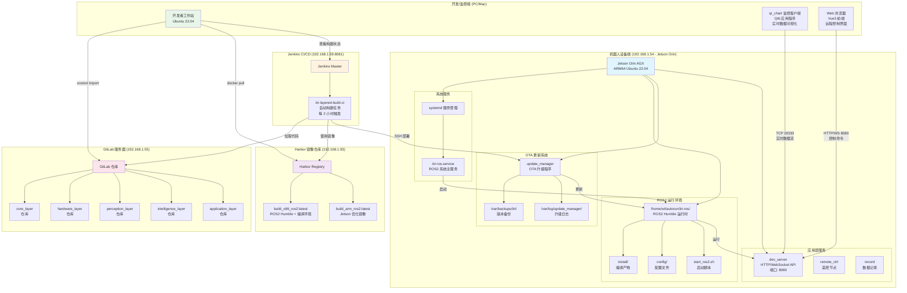

### 1.2 版本管理和部署策略

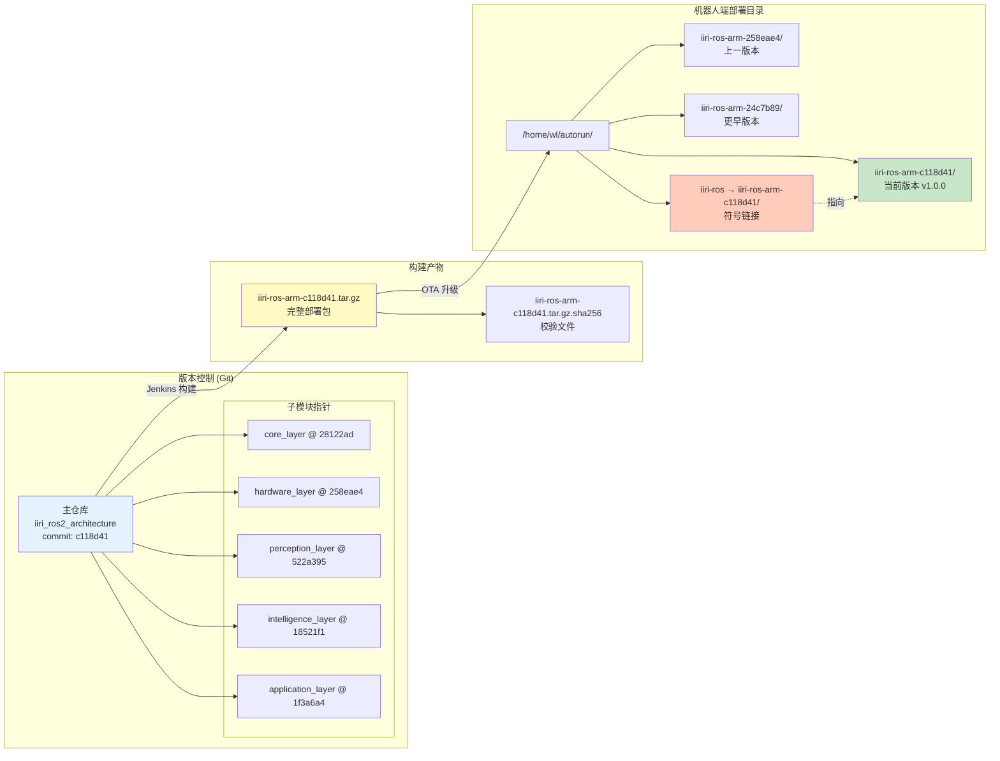

---

## 2. ROS2 五层架构详细图

### 2.1 完整五层架构组件图

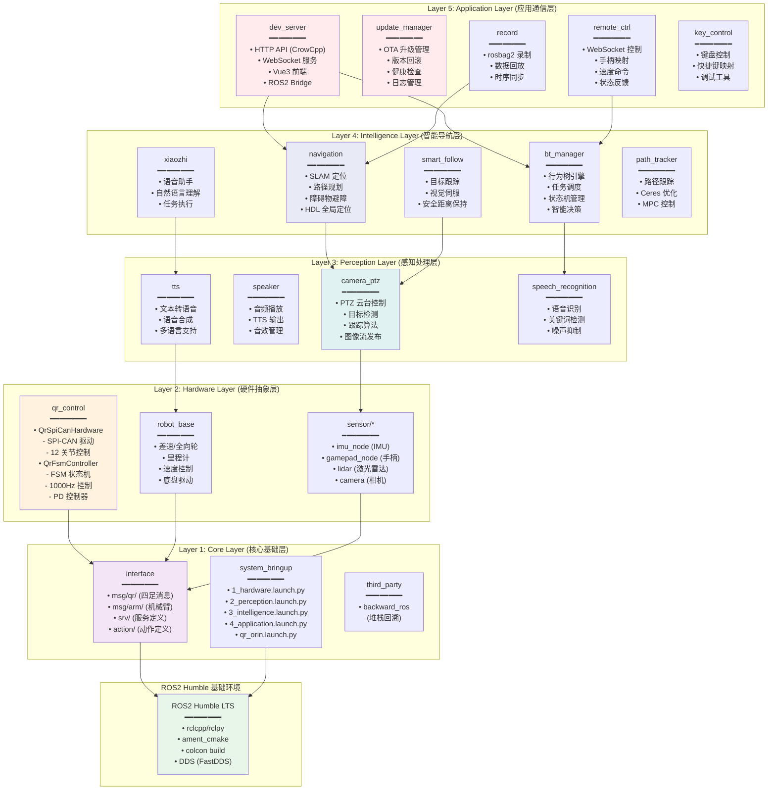

### 2.2 ROS2 Overlay 构建流程

---

## 3. qr_wl → ros2_control 迁移架构

### 3.1 架构对比图

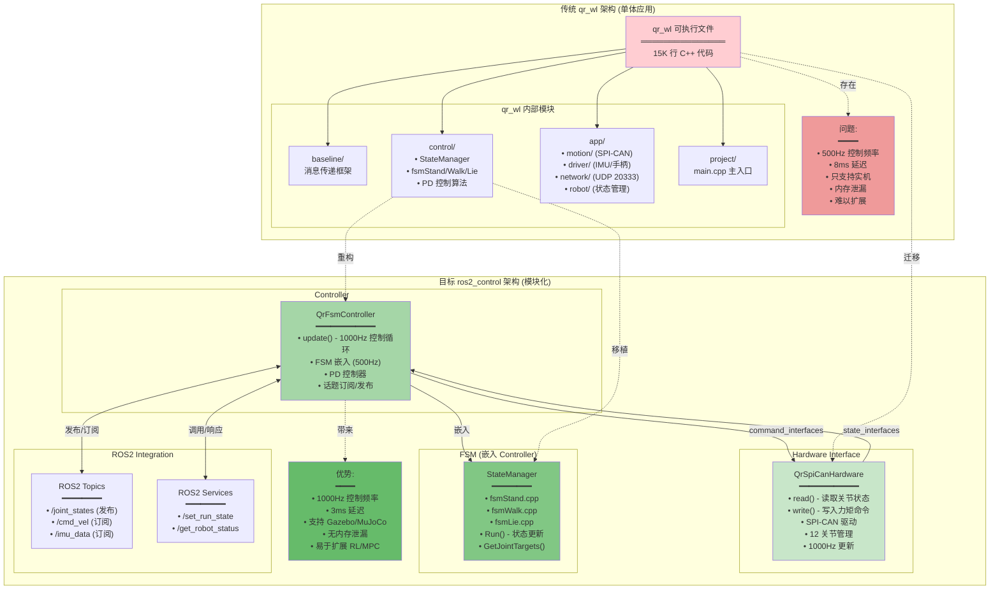

### 3.2 控制回路详细流程

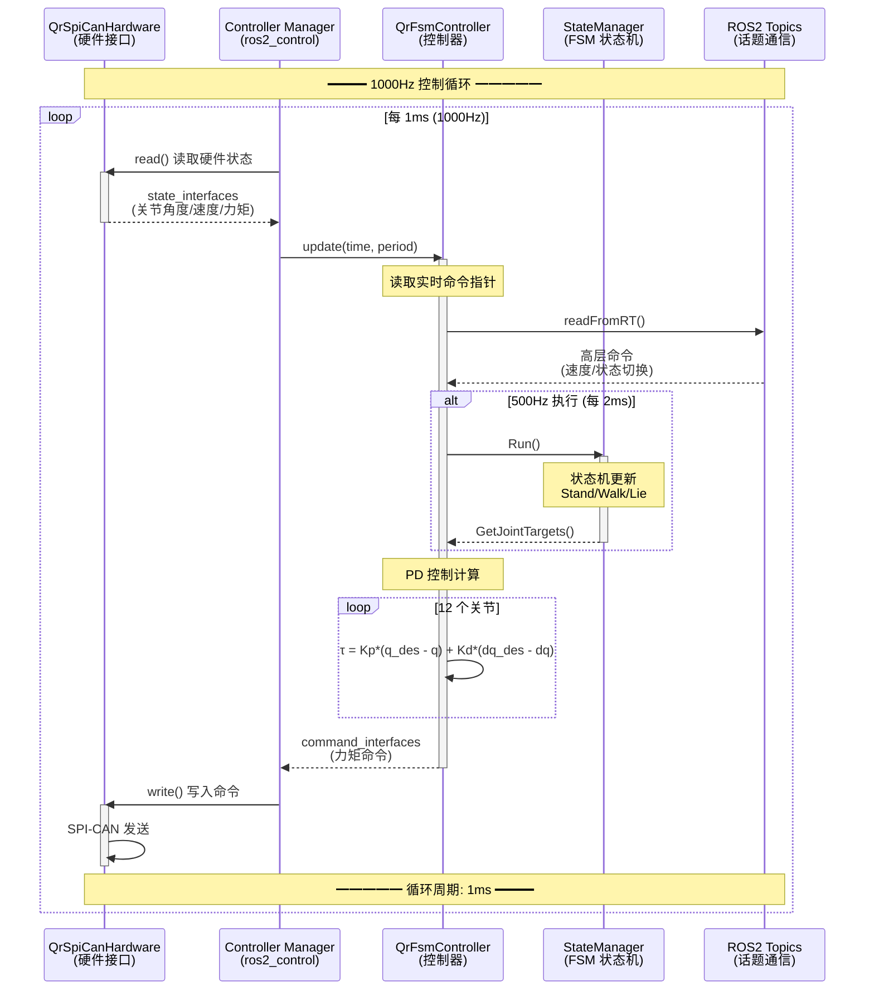

---

## 4. 网络通信和数据流

### 4.1 完整通信架构

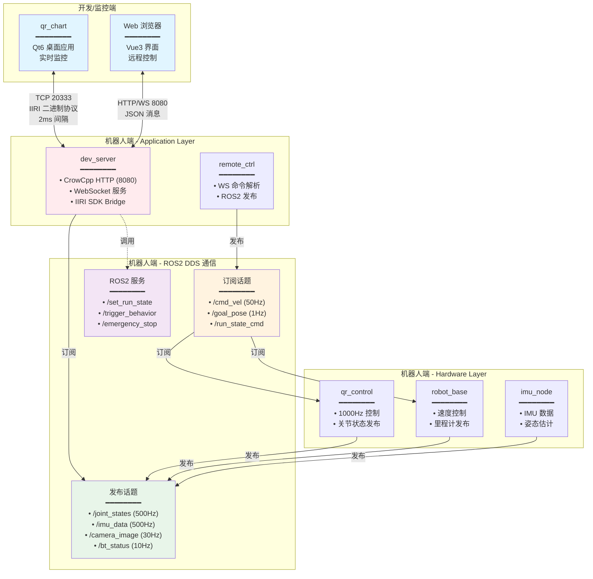

### 4.2 实时数据流 (500Hz)

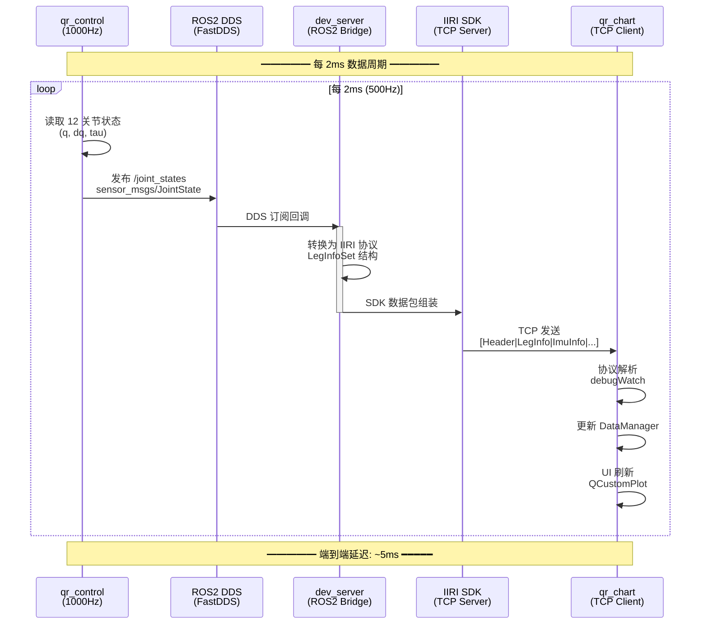

### 4.3 端口和协议映射

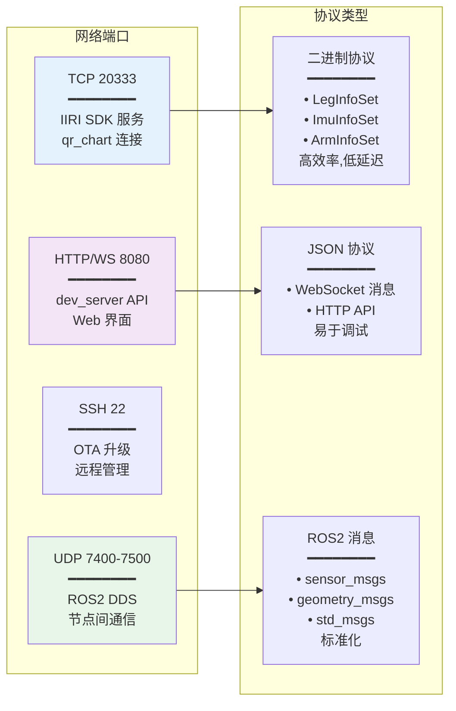

---

## 5. OTA 升级流程

### 5.1 完整升级状态机

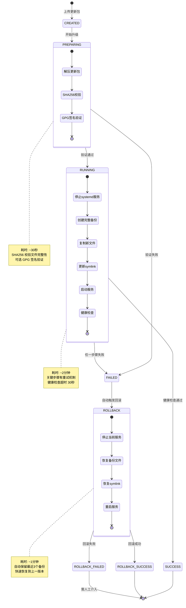

### 5.2 OTA 升级详细流程

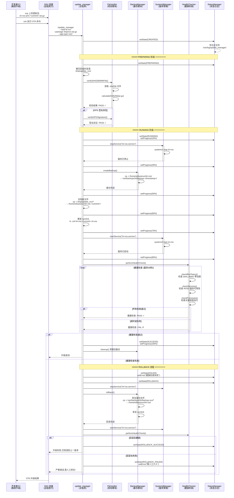

### 5.3 升级管理器模块架构

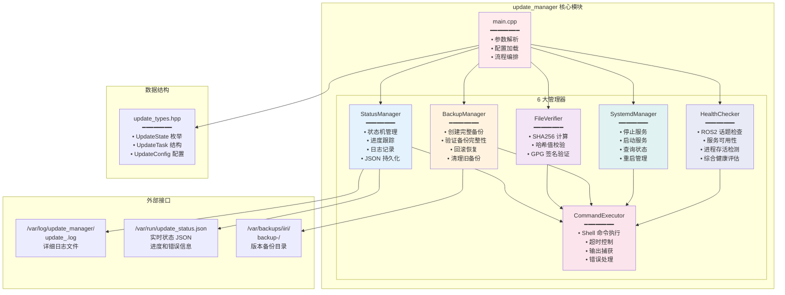

---

## 6. qr_chart 监控客户端架构

### 6.1 四层架构详细图

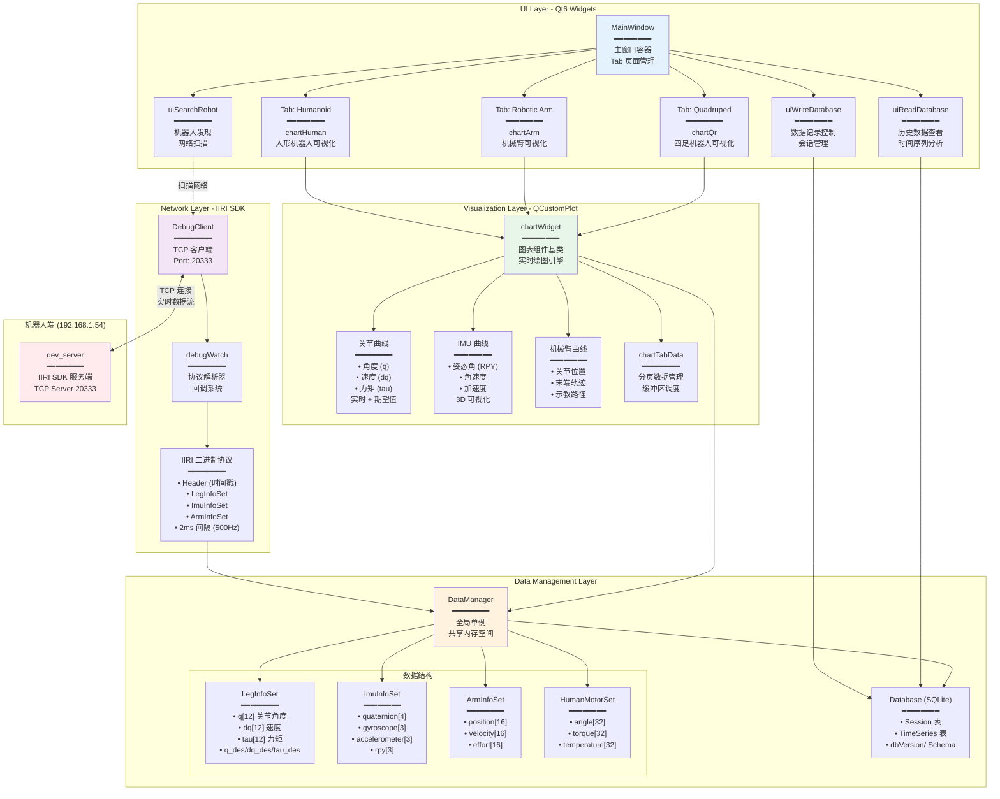

### 6.2 实时数据更新流程

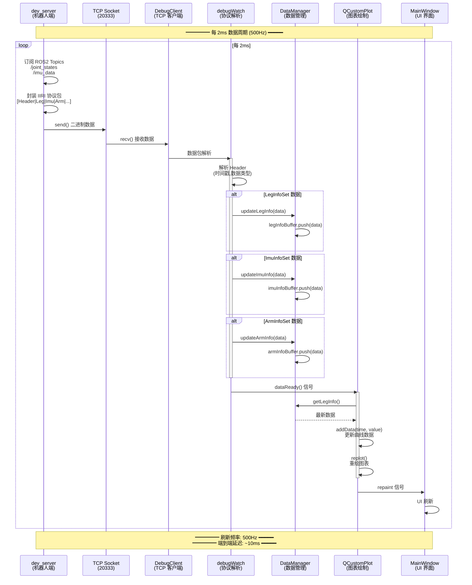

---

## 7. CI/CD 流水线

### 7.1 Jenkins 自动构建流程

```mermaid
graph TB
    START([Jenkins 触发器])

    subgraph "触发条件"
        CRON["定时触发<br/>H */2 * * *<br/>(每2小时)"]
        GIT_PUSH["Git Push<br/>主分支提交"]
        MANUAL["手动触发<br/>Jenkins UI"]
    end

    START --> CRON
    START --> GIT_PUSH
    START --> MANUAL

    CRON --> STAGE1
    GIT_PUSH --> STAGE1
    MANUAL --> STAGE1

    subgraph "Stage 1: 代码导入"
        STAGE1["vcstool 导入<br/>━━━━━━━━"]
        CLONE["克隆主仓库<br/>iiri_ros2_architecture"]
        VCS_IMPORT["vcs import src < .repos<br/>导入 5 个分层仓库"]
        GIT_INFO["生成 Git 版本信息<br/>commit hash + tag"]

        STAGE1 --> CLONE
        CLONE --> VCS_IMPORT
        VCS_IMPORT --> GIT_INFO
    end

    subgraph "Stage 2: Docker 环境"
        STAGE2["Docker 准备<br/>━━━━━━━━"]
        DOCKER_LOGIN["登录 Harbor<br/>192.168.1.93"]
        DOCKER_PULL["拉取镜像<br/>build_x86_ros2:latest"]
        DOCKER_RUN["启动构建容器<br/>挂载工作空间"]

        GIT_INFO --> STAGE2
        STAGE2 --> DOCKER_LOGIN
        DOCKER_LOGIN --> DOCKER_PULL
        DOCKER_PULL --> DOCKER_RUN
    end

    subgraph "Stage 3: 分层编译"
        STAGE3["Colcon 构建<br/>━━━━━━━━"]
        BUILD_CORE["Layer 1: core_layer<br/>source /opt/ros/humble/setup.bash"]
        BUILD_HW["Layer 2: hardware_layer<br/>overlay core_layer"]
        BUILD_PERC["Layer 3: perception_layer<br/>overlay hardware_layer"]
        BUILD_INT["Layer 4: intelligence_layer<br/>overlay perception_layer"]
        BUILD_APP["Layer 5: application_layer<br/>overlay intelligence_layer"]

        DOCKER_RUN --> STAGE3
        STAGE3 --> BUILD_CORE
        BUILD_CORE --> BUILD_HW
        BUILD_HW --> BUILD_PERC
        BUILD_PERC --> BUILD_INT
        BUILD_INT --> BUILD_APP
    end

    subgraph "Stage 4: 打包归档"
        STAGE4["Artifact 生成<br/>━━━━━━━━"]
        TAR_CREATE["压缩构建产物<br/>tar -czf iiri-ros-x86-<commit>.tar.gz"]
        SHA_GEN["生成 SHA256<br/>sha256sum > .tar.gz.sha256"]
        ARCHIVE["归档到 Jenkins<br/>/var/jenkins_home/workspace/"]

        BUILD_APP --> STAGE4
        STAGE4 --> TAR_CREATE
        TAR_CREATE --> SHA_GEN
        SHA_GEN --> ARCHIVE
    end

    subgraph "Stage 5: 测试 (可选)"
        STAGE5["自动化测试<br/>━━━━━━━━"]
        UNIT_TEST["单元测试<br/>colcon test"]
        INT_TEST["集成测试<br/>system_bringup 启动"]
        PERF_TEST["性能测试<br/>ROS2 topic 频率"]

        ARCHIVE --> STAGE5
        STAGE5 --> UNIT_TEST
        UNIT_TEST --> INT_TEST
        INT_TEST --> PERF_TEST
    end

    subgraph "Stage 6: 部署"
        STAGE6["远程部署<br/>━━━━━━━━"]
        SCP_UPLOAD["上传到机器人<br/>scp → 192.168.1.54:/tmp/"]
        TRIGGER_OTA["触发 OTA 升级<br/>ssh update_manager"]
        HEALTH_CHECK["验证部署<br/>健康检查"]

        PERF_TEST --> STAGE6
        STAGE6 --> SCP_UPLOAD
        SCP_UPLOAD --> TRIGGER_OTA
        TRIGGER_OTA --> HEALTH_CHECK
    end

    HEALTH_CHECK --> SUCCESS([构建成功])
    HEALTH_CHECK -.失败.-> FAIL([构建失败])

    SUCCESS --> NOTIFY["通知<br/>━━━━━━━━<br/>• Email<br/>• 企业微信<br/>• Slack"]
    FAIL --> NOTIFY

    style START fill:#e8f5e9
    style SUCCESS fill:#c8e6c9
    style FAIL fill:#ffcdd2
    style NOTIFY fill:#fff9c4
```

### 7.2 Harbor 镜像管理

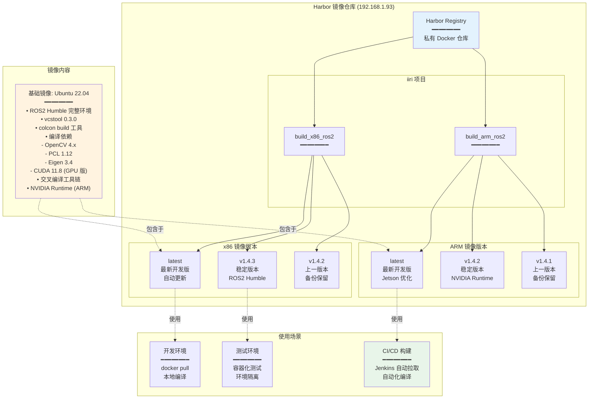

---

## 8. 完整技术栈

### 8.1 系统技术栈全景图

```mermaid
graph TB
    subgraph "操作系统层"
        OS_DEV["开发端<br/>Ubuntu 22.04 LTS<br/>Linux Kernel 6.8"]
        OS_ROBOT["机器人端<br/>Ubuntu 22.04 LTS<br/>Jetson Linux 35.x"]
    end

    subgraph "容器化层"
        DOCKER["Docker 20.10+<br/>━━━━━━━━<br/>容器运行时"]
        HARBOR["Harbor 2.x<br/>━━━━━━━━<br/>镜像仓库"]

        DOCKER --> HARBOR
    end

    subgraph "ROS2 中间件层"
        ROS2["ROS2 Humble LTS<br/>━━━━━━━━"]
        DDS["FastDDS<br/>DDS 实现"]
        RCLCPP["rclcpp<br/>C++ 客户端库"]
        RCLPY["rclpy<br/>Python 客户端库"]

        ROS2 --> DDS
        ROS2 --> RCLCPP
        ROS2 --> RCLPY
    end

    subgraph "构建系统层"
        COLCON["colcon 0.12+<br/>━━━━━━━━<br/>ROS2 构建工具"]
        CMAKE["CMake 3.16+<br/>━━━━━━━━<br/>构建配置"]
        AMENT["ament_cmake<br/>━━━━━━━━<br/>ROS2 扩展"]

        COLCON --> CMAKE
        COLCON --> AMENT
    end

    subgraph "版本管理层"
        GIT["Git 2.x<br/>━━━━━━━━<br/>版本控制"]
        VCSTOOL["vcstool 0.3.0<br/>━━━━━━━━<br/>多仓库管理"]
        GITLAB["GitLab<br/>━━━━━━━━<br/>代码托管"]

        GIT --> GITLAB
        VCSTOOL --> GIT
    end

    subgraph "CI/CD 层"
        JENKINS["Jenkins 2.x<br/>━━━━━━━━<br/>自动化构建"]
        PIPELINE["Jenkinsfile<br/>━━━━━━━━<br/>流水线定义"]

        JENKINS --> PIPELINE
    end

    subgraph "应用框架层"
        ROS2CTRL["ros2_control<br/>━━━━━━━━<br/>实时控制框架"]
        QT6["Qt6 6.2+<br/>━━━━━━━━<br/>GUI 框架"]
        VUE3["Vue3 3.x<br/>━━━━━━━━<br/>Web 前端"]

        ROS2CTRL --> ROS2
        QT6 -.客户端.-> QT6
        VUE3 -.Web界面.-> VUE3
    end

    subgraph "核心库层"
        EIGEN["Eigen 3.4<br/>━━━━━━━━<br/>线性代数"]
        OPENCV["OpenCV 4.x<br/>━━━━━━━━<br/>计算机视觉"]
        PCL["PCL 1.12<br/>━━━━━━━━<br/>点云处理"]
        CERES["Ceres 2.x<br/>━━━━━━━━<br/>优化库"]
        BOOST["Boost 1.74<br/>━━━━━━━━<br/>C++ 扩展"]
        OPENSSL["OpenSSL 3.x<br/>━━━━━━━━<br/>加密库"]

        ROS2CTRL --> EIGEN
        ROS2 --> OPENCV
        ROS2 --> PCL
        ROS2CTRL -.可选.-> CERES
    end

    subgraph "网络通信层"
        TCP["TCP/IP<br/>━━━━━━━━<br/>可靠传输"]
        WS["WebSocket<br/>━━━━━━━━<br/>实时通信"]
        HTTP["HTTP/HTTPS<br/>━━━━━━━━<br/>Web API"]
        SSH["SSH<br/>━━━━━━━━<br/>安全远程"]

        DDS --> TCP
        VUE3 --> WS
        VUE3 --> HTTP
    end

    subgraph "数据存储层"
        SQLITE["SQLite 3.x<br/>━━━━━━━━<br/>嵌入式数据库"]
        ROSBAG["rosbag2<br/>━━━━━━━━<br/>时序数据"]
        JSON["JSON<br/>━━━━━━━━<br/>配置文件"]
    end

    subgraph "硬件驱动层"
        SPI["SPI-CAN<br/>━━━━━━━━<br/>电机通信"]
        IMU_DRV["IMU Driver<br/>━━━━━━━━<br/>惯性传感器"]
        LIDAR_DRV["LiDAR Driver<br/>━━━━━━━━<br/>激光雷达"]
        CAM_DRV["Camera Driver<br/>━━━━━━━━<br/>相机驱动"]
    end

    %% 层间依赖
    OS_DEV --> DOCKER
    OS_ROBOT --> ROS2
    DOCKER --> ROS2
    ROS2 --> COLCON
    COLCON --> GIT
    GIT --> JENKINS
    JENKINS --> HARBOR

    ROS2 --> ROS2CTRL
    ROS2CTRL --> SPI
    ROS2 --> IMU_DRV
    ROS2 --> LIDAR_DRV
    ROS2 --> CAM_DRV

    QT6 --> SQLITE
    ROS2 --> ROSBAG

    style OS_ROBOT fill:#e8f5e9
    style ROS2 fill:#e3f2fd
    style ROS2CTRL fill:#fff3e0
    style QT6 fill:#f3e5f5
    style JENKINS fill:#fff9c4
```

### 8.2 依赖关系矩阵

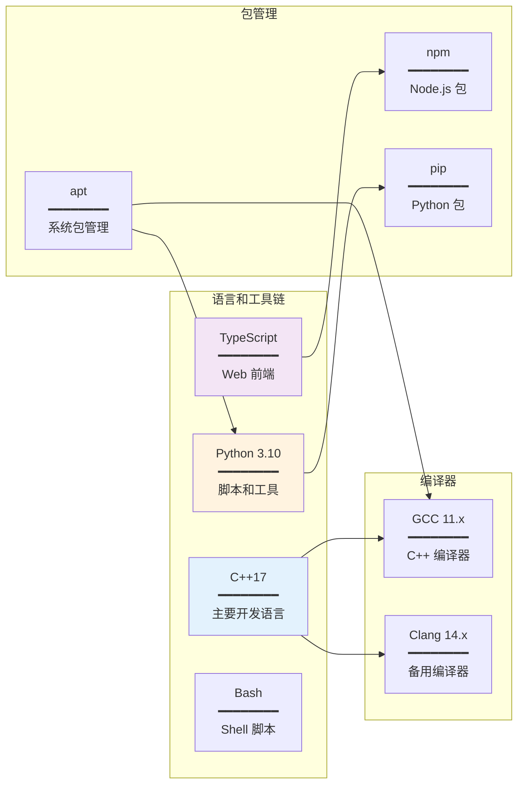

---

## 总结

本文档提供了 IIRI 机器人系统的完整可视化架构图,涵盖:

1. **系统部署**: 物理拓扑、网络连接、版本管理
2. **ROS2 架构**: 五层分层、Overlay 机制、组件依赖
3. **qr_wl 迁移**: 架构对比、控制回路、性能提升
4. **网络通信**: 协议栈、数据流、端口映射
5. **OTA 升级**: 状态机、详细流程、模块架构
6. **qr_chart**: 四层架构、实时数据、UI 组件
7. **CI/CD**: Jenkins 流水线、Harbor 镜像管理
8. **技术栈**: 完整的软件栈和依赖关系

所有图表使用 Mermaid 格式,支持在 GitHub、GitLab、VS Code 等平台直接渲染。

**查看方式**:
- GitHub/GitLab: 自动渲染
- VS Code: 安装 "Markdown Preview Mermaid Support" 插件
- 在线工具: https://mermaid.live/

---

**文档版本**: v1.0.0
**最后更新**: 2025-10-30
**维护者**: 唐文浩
