# IIRI 机器人系统超详细架构图

**文档版本**: v2.0.0
**创建日期**: 2025-10-30
**作者**: 唐文浩
**说明**: 本文档包含新架构的完整可视化图表,包含所有端口、协议、数据格式等详细信息

---

## 📋 目录

1. [系统整体拓扑图](#1-系统整体拓扑图)
2. [通信流程与协议详解](#2-通信流程与协议详解)
3. [ROS2 五层架构详细组件图](#3-ros2-五层架构详细组件图)
4. [qr_wl 详细架构(旧架构参考)](#4-qr_wl-详细架构旧架构参考)
5. [wl_ros 详细架构(旧架构参考)](#5-wl_ros-详细架构旧架构参考)
6. [ros2_control 新架构详细图](#6-ros2_control-新架构详细图)
7. [qr_wl → ros2_control 迁移对比](#7-qr_wl--ros2_control-迁移对比)
8. [OTA 升级完整流程](#8-ota-升级完整流程)
9. [qr_chart 监控客户端详细架构](#9-qr_chart-监控客户端详细架构)
10. [网络拓扑与数据流](#10-网络拓扑与数据流)

---

## 1. 系统整体拓扑图

### 1.1 物理设备与网络拓扑

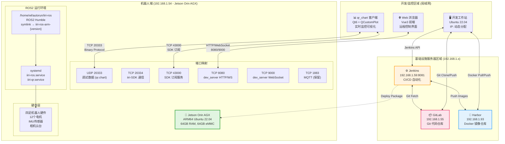
```mermaid
graph TB
    subgraph "开发/监控区域 (局域网)"
        DEV["🖥️ 开发工作站<br/>Ubuntu 22.04<br/>IP: 动态分配"]
        QR_CHART["📊 qr_chart 客户端<br/>Qt6 + QCustomPlot<br/>实时监控可视化"]
        WEB_CLIENT["🌐 Web 浏览器<br/>Vue3 前端<br/>远程控制界面"]
    end

    subgraph "基础设施服务器区域 (192.168.1.x)"
        GITLAB["📦 GitLab<br/>192.168.1.55<br/>Git 代码仓库"]
        HARBOR["🐳 Harbor<br/>192.168.1.93<br/>Docker 镜像仓库"]
        JENKINS["⚙️ Jenkins<br/>192.168.1.59:8081<br/>CI/CD 自动化"]
    end

    subgraph "机器人端 (192.168.1.54 - Jetson Orin AGX)"
        JETSON["🤖 Jetson Orin AGX<br/>ARM64 Ubuntu 22.04<br/>64GB RAM, 64GB eMMC"]

        subgraph "端口映射"
            PORT_20333["UDP 20333<br/>调试数据 (qr.chart)"]
            PORT_20334["TCP 20334<br/>iiri-SDK 通信"]
            PORT_43000["TCP 43000<br/>SDK 订阅服务"]
            PORT_8080["TCP 8080<br/>dev_server HTTP/WS"]
            PORT_9000["TCP 9000<br/>dev_server WebSocket"]
            PORT_1883["TCP 1883<br/>MQTT (保留)"]
        end

        subgraph "ROS2 运行环境"
            ROS2_ENV["/home/wl/autorun/iiri-ros<br/>ROS2 Humble<br/>symlink → iiri-ros-arm-{version}"]
            SYSTEMD_SVC["systemd<br/>iiri-ros.service<br/>iiri-qr.service"]
        end

        subgraph "硬件层"
            QR_HARDWARE["四足机器人硬件<br/>12个电机<br/>IMU传感器<br/>相机云台"]
        end
    end

    %% 连接关系 - 开发监控
    DEV <-->|Git Clone/Push| GITLAB
    DEV <-->|Docker Pull/Push| HARBOR
    DEV <-->|Jenkins API| JENKINS
    QR_CHART <-->|TCP 20333<br/>Binary Protocol| PORT_20333
    QR_CHART <-->|TCP 43000<br/>SDK 订阅| PORT_43000
    WEB_CLIENT <-->|HTTP/WebSocket<br/>8080/9000| PORT_8080

    %% 连接关系 - CI/CD
    JENKINS <-->|Git Fetch| GITLAB
    JENKINS <-->|Push Images| HARBOR
    JENKINS -.->|Deploy Package| JETSON

    %% 连接关系 - 机器人内部
    ROS2_ENV --> SYSTEMD_SVC
    SYSTEMD_SVC --> QR_HARDWARE

    style JETSON fill:#e1f5e1,stroke:#4caf50,stroke-width:3px
    style GITLAB fill:#fce4ec,stroke:#e91e63,stroke-width:2px
    style HARBOR fill:#e3f2fd,stroke:#2196f3,stroke-width:2px
    style JENKINS fill:#fff3e0,stroke:#ff9800,stroke-width:2px
```

### 1.2 端口总览表

| 端口 | 协议 | 用途 | 数据格式 | 频率 |
|------|------|------|----------|------|
| **20333** | UDP | qr.chart 调试数据 | JSON-RPC 2.0 | 500Hz |
| **20334** | TCP | iiri-SDK 控制 | Binary Protocol | - |
| **43000** | TCP | SDK 订阅服务 | Binary Protocol | 1-500KHz |
| **8080** | HTTP | dev_server Web界面 | HTTP/1.1 | - |
| **9000** | WebSocket | 远程控制数据推送 | JSON | 实时 |
| **1883** | MQTT | 保留(未来扩展) | MQTT 3.1.1 | - |

---

## 2. 通信流程与协议详解

### 2.1 端口总线与协议栈

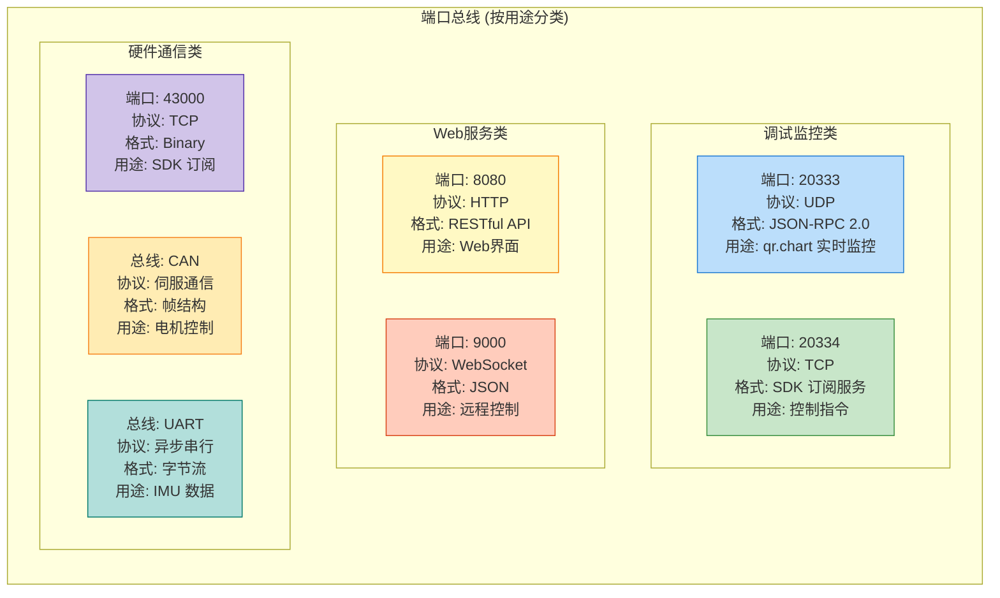
```mermaid
graph LR
    subgraph "端口总线 (按用途分类)"
        subgraph "调试监控类"
            P1["端口: 20333<br/>协议: UDP<br/>格式: JSON-RPC 2.0<br/>用途: qr.chart 实时监控"]
            P2["端口: 20334<br/>协议: TCP<br/>格式: SDK 订阅服务<br/>用途: 控制指令"]
        end

        subgraph "Web服务类"
            P3["端口: 8080<br/>协议: HTTP<br/>格式: RESTful API<br/>用途: Web界面"]
            P4["端口: 9000<br/>协议: WebSocket<br/>格式: JSON<br/>用途: 远程控制"]
        end

        subgraph "硬件通信类"
            P5["端口: 43000<br/>协议: TCP<br/>格式: Binary<br/>用途: SDK 订阅"]
            P6["总线: CAN<br/>协议: 伺服通信<br/>格式: 帧结构<br/>用途: 电机控制"]
            P7["总线: UART<br/>协议: 异步串行<br/>格式: 字节流<br/>用途: IMU 数据"]
        end
    end

    style P1 fill:#bbdefb,stroke:#1976d2
    style P2 fill:#c8e6c9,stroke:#388e3c
    style P3 fill:#fff9c4,stroke:#f57c00
    style P4 fill:#ffccbc,stroke:#d84315
    style P5 fill:#d1c4e9,stroke:#512da8
    style P6 fill:#ffecb3,stroke:#f57f17
    style P7 fill:#b2dfdb,stroke:#00796b
```

### 2.2 JSON-RPC 2.0 协议格式 (端口 20333)

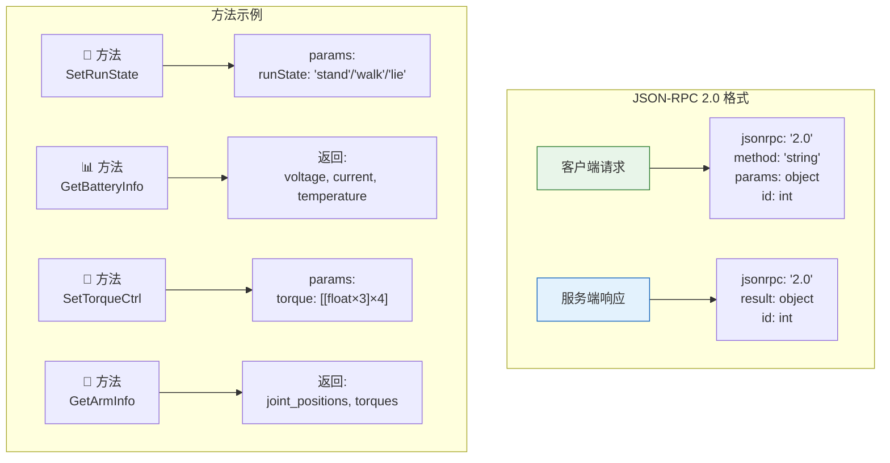
```mermaid
graph TB
    subgraph "JSON-RPC 2.0 格式"
        REQUEST["客户端请求"]
        RESPONSE["服务端响应"]

        REQUEST --> R1["jsonrpc: '2.0'<br/>method: 'string'<br/>params: object<br/>id: int"]
        RESPONSE --> R2["jsonrpc: '2.0'<br/>result: object<br/>id: int"]
    end

    subgraph "方法示例"
        M1["🔧 方法<br/>SetRunState"]
        M2["📊 方法<br/>GetBatteryInfo"]
        M3["🤖 方法<br/>SetTorqueCtrl"]
        M4["📡 方法<br/>GetArmInfo"]

        M1 --> EX1["params:<br/>runState: 'stand'/'walk'/'lie'"]
        M2 --> EX2["返回:<br/>voltage, current, temperature"]
        M3 --> EX3["params:<br/>torque: [[float×3]×4]"]
        M4 --> EX4["返回:<br/>joint_positions, torques"]
    end

    style REQUEST fill:#e8f5e9,stroke:#2e7d32
    style RESPONSE fill:#e3f2fd,stroke:#1565c0
```

### 2.3 Binary Protocol 格式 (qr.chart 端口 20334)

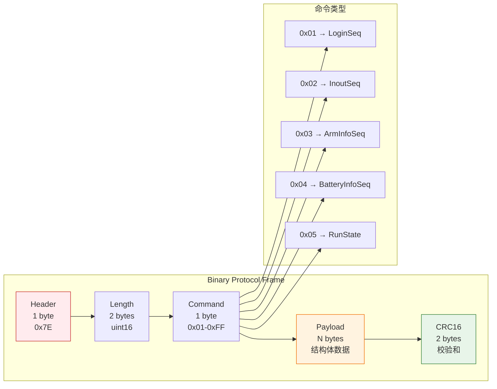
```mermaid
graph LR
    subgraph "Binary Protocol Frame"
        HEADER["Header<br/>1 byte<br/>0x7E"]
        LENGTH["Length<br/>2 bytes<br/>uint16"]
        CMD["Command<br/>1 byte<br/>0x01-0xFF"]
        PAYLOAD["Payload<br/>N bytes<br/>结构体数据"]
        CRC["CRC16<br/>2 bytes<br/>校验和"]

        HEADER --> LENGTH
        LENGTH --> CMD
        CMD --> PAYLOAD
        PAYLOAD --> CRC
    end

    subgraph "命令类型"
        C1["0x01 → LoginSeq"]
        C2["0x02 → InoutSeq"]
        C3["0x03 → ArmInfoSeq"]
        C4["0x04 → BatteryInfoSeq"]
        C5["0x05 → RunState"]
    end

    CMD --> C1
    CMD --> C2
    CMD --> C3
    CMD --> C4
    CMD --> C5

    style HEADER fill:#ffebee,stroke:#c62828
    style CRC fill:#e8f5e9,stroke:#2e7d32
    style PAYLOAD fill:#fff3e0,stroke:#ef6c00
```

### 2.4 协议格式详解

#### JSON-RPC 示例 (端口 20333)

```json
// 请求: 设置运行状态为站立
{
  "jsonrpc": "2.0",
  "method": "SetRunState",
  "params": {
    "run_state": "stand"
  },
  "id": 1
}

// 响应: 成功
{
  "jsonrpc": "2.0",
  "result": "ok",
  "id": 1
}
```

#### Binary Protocol 示例 (qr.chart 端口 20334)

```
帧结构:
[0x7E] [0x00 0x0C] [0x05] [0x01 0x02 0x03...] [0xAB 0xCD]
  ↑       ↑         ↑           ↑              ↑
 头部   长度=12   命令=5      payload       CRC16

实际数据 (站立命令):
7E 00 04 05 01 E3 2F
```

---

## 3. ROS2 五层架构详细组件图

### 3.1 五层架构总览 + Topic/Service 通信

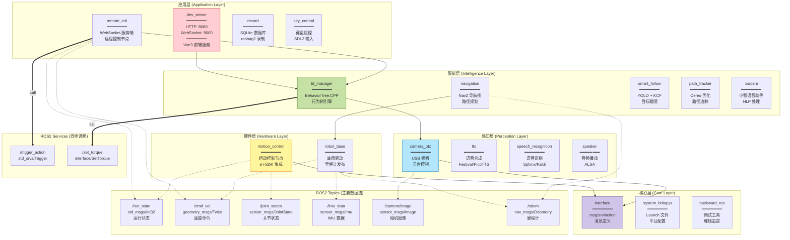
```mermaid
graph TB
    subgraph "应用层 (Application Layer)"
        APP_DEV["dev_server<br/>━━━━━━━━<br/>HTTP: 8080<br/>WebSocket: 9000<br/>━━━━━━━━<br/>Vue3 前端服务"]
        APP_REMOTE["remote_ctrl<br/>━━━━━━━━<br/>WebSocket 服务端<br/>远程控制节点"]
        APP_RECORD["record<br/>━━━━━━━━<br/>SQLite 数据库<br/>rosbag2 录制"]
        APP_KEY["key_control<br/>━━━━━━━━<br/>键盘遥控<br/>SDL2 输入"]
    end

    subgraph "智能层 (Intelligence Layer)"
        INT_BT["bt_manager<br/>━━━━━━━━<br/>BehaviorTree.CPP<br/>行为树引擎"]
        INT_NAV["navigation<br/>━━━━━━━━<br/>Nav2 导航栈<br/>路径规划"]
        INT_FOLLOW["smart_follow<br/>━━━━━━━━<br/>YOLO + KCF<br/>目标跟随"]
        INT_TRACK["path_tracker<br/>━━━━━━━━<br/>Ceres 优化<br/>路径追踪"]
        INT_XIAOZHI["xiaozhi<br/>━━━━━━━━<br/>小智语音助手<br/>NLP 处理"]
    end

    subgraph "感知层 (Perception Layer)"
        PERC_CAM["camera_ptz<br/>━━━━━━━━<br/>USB 相机<br/>云台控制"]
        PERC_TTS["tts<br/>━━━━━━━━<br/>语音合成<br/>Festival/PicoTTS"]
        PERC_ASR["speech_recognition<br/>━━━━━━━━<br/>语音识别<br/>Sphinx/Kaldi"]
        PERC_SPEAKER["speaker<br/>━━━━━━━━<br/>音频播放<br/>ALSA"]
    end

    subgraph "硬件层 (Hardware Layer)"
        HW_MOTION["motion_control<br/>━━━━━━━━<br/>运动控制节点<br/>iiri-SDK 集成"]
        HW_BASE["robot_base<br/>━━━━━━━━<br/>底盘驱动<br/>里程计发布"]
    end

    subgraph "核心层 (Core Layer)"
        CORE_MSG["interface<br/>━━━━━━━━<br/>msg/srv/action<br/>消息定义"]
        CORE_BRINGUP["system_bringup<br/>━━━━━━━━<br/>Launch 文件<br/>平台配置"]
        CORE_TOOLS["backward_ros<br/>━━━━━━━━<br/>调试工具<br/>堆栈追踪"]
    end

    subgraph "ROS2 Topics (主要数据流)"
        T1["/run_state<br/>std_msgs/Int32<br/>运行状态"]
        T2["/cmd_vel<br/>geometry_msgs/Twist<br/>速度命令"]
        T3["/joint_states<br/>sensor_msgs/JointState<br/>关节状态"]
        T4["/imu_data<br/>sensor_msgs/Imu<br/>IMU 数据"]
        T5["/camera/image<br/>sensor_msgs/Image<br/>相机图像"]
        T6["/odom<br/>nav_msgs/Odometry<br/>里程计"]
    end

    subgraph "ROS2 Services (同步调用)"
        S1["/trigger_action<br/>std_srvs/Trigger"]
        S2["/set_torque<br/>interface/SetTorque"]
    end

    %% 层间依赖关系
    APP_DEV --> INT_BT
    APP_REMOTE --> INT_BT
    INT_BT --> PERC_CAM
    INT_NAV --> HW_BASE
    HW_MOTION --> CORE_MSG
    PERC_CAM --> CORE_MSG

    %% Topic 通信
    APP_REMOTE -.-> T1
    HW_MOTION -.-> T1
    APP_REMOTE -.-> T2
    HW_BASE -.-> T2
    HW_MOTION -.-> T3
    HW_BASE -.-> T4
    PERC_CAM -.-> T5
    HW_BASE -.-> T6
    INT_NAV -.-> T6

    %% Service 调用
    APP_REMOTE ==>|call| S1
    INT_BT ==>|call| S2

    style APP_DEV fill:#ffcdd2,stroke:#c62828
    style INT_BT fill:#c5e1a5,stroke:#558b2f
    style PERC_CAM fill:#b3e5fc,stroke:#0277bd
    style HW_MOTION fill:#fff59d,stroke:#f57f17
    style CORE_MSG fill:#d1c4e9,stroke:#512da8
```

### 3.2 节点通信矩阵 (Topics & Services)

| 发布节点 | Topic | 消息类型 | 订阅节点 | 频率 |
|----------|-------|----------|----------|------|
| remote_ctrl | /run_state | std_msgs/Int32 | motion_control | 事件触发 |
| robot_base | /odom | nav_msgs/Odometry | navigation | 50Hz |
| motion_control | /joint_states | sensor_msgs/JointState | - | 100Hz |
| robot_base | /imu_data | sensor_msgs/Imu | navigation | 100Hz |
| camera_ptz | /camera/image | sensor_msgs/Image | smart_follow | 30Hz |
| key_control | /cmd_vel | geometry_msgs/Twist | robot_base | 10Hz |

| 服务提供者 | Service | 服务类型 | 调用者 |
|------------|---------|----------|--------|
| motion_control | /set_torque | interface/SetTorque | bt_manager |
| bt_manager | /trigger_action | std_srvs/Trigger | remote_ctrl |
| smart_follow | /start_follow | std_srvs/Trigger | bt_manager |

---

## 4. qr_wl 详细架构(旧架构参考)

> 基于旧架构图 `qr_wl_detailed.png` 整理

### 4.1 qr_wl 单体架构 (15000行代码)

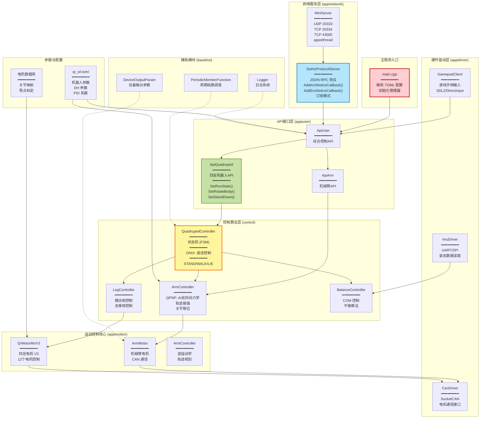
```mermaid
graph TB
    subgraph "主程序入口"
        MAIN["main.cpp<br/>━━━━━━━━<br/>解析 TOML 配置<br/>初始化管理器"]
    end

    subgraph "辅助模块 (baseline)"
        LOGGER["Logger<br/>日志系统"]
        DEVICE["DeviceOutputParam<br/>设备输出参数"]
        PERIODIC["PeriodicMemberFunction<br/>周期函数调度"]
    end

    subgraph "运动控制核心 (appimotion)"
        ARM_MOTOR["ArmMotor<br/>━━━━━━━━<br/>机械臂电机<br/>CAN 通信"]
        QR_MOTOR["QrMotorMnV3<br/>━━━━━━━━<br/>四足电机 V3<br/>12个电机控制"]
        ARM_CONTROLLER["ArmController<br/>━━━━━━━━<br/>逆运动学<br/>轨迹规划"]
    end

    subgraph "API接口层 (appiuser)"
        API_ARM["ApiArm<br/>━━━━━━━━<br/>机械臂API"]
        API_QR["ApiQuadruped<br/>━━━━━━━━<br/>四足机器人API<br/>━━━━━━━━<br/>SetRunState()<br/>SetRotateBody()<br/>SetStandDown()"]
        API_USER["ApiUser<br/>━━━━━━━━<br/>综合控制API"]
    end

    subgraph "控制算法层 (control)"
        ARM_CONTROL["ArmController<br/>━━━━━━━━<br/>QPNP: AI反向动力学<br/>轨迹插值<br/>关节限位"]
        LEG_CONTROL["LegController<br/>━━━━━━━━<br/>摆动相控制<br/>支撑相控制"]
        BALANCE["BalanceController<br/>━━━━━━━━<br/>COM 控制<br/>平衡算法"]
        FSM["QuadrupedController<br/>━━━━━━━━<br/>状态机 (FSM)<br/>━━━━━━━━<br/>ONIX: 姿态控制<br/>━━━━━━━━<br/>STAND/WALK/LIE"]
    end

    subgraph "网络服务层 (appinetwork)"
        MINI_SERVER["MiniServer<br/>━━━━━━━━<br/>UDP 20333<br/>TCP 20334<br/>TCP 43000<br/>appstthread"]
        HTTP_SERVER["SetHzProtocolServer<br/>━━━━━━━━<br/>JSON-RPC 协议<br/>AddArmNoticeCallback()<br/>AddEnvNoticeCallback()<br/>订阅模式"]
    end

    subgraph "硬件驱动层 (appidriver)"
        GAMEPAD["GamepadClient<br/>━━━━━━━━<br/>游戏手柄输入<br/>SDL2/DirectInput"]
        CAN_DRIVER["CanDriver<br/>━━━━━━━━<br/>SocketCAN<br/>电机通信接口"]
        IMU_DRIVER["ImuDriver<br/>━━━━━━━━<br/>UART/SPI<br/>姿态数据读取"]
    end

    subgraph "参数与配置"
        CONFIG_TOML["qr_wl.toml<br/>━━━━━━━━<br/>机器人参数<br/>DH 参数<br/>PID 系数"]
        MOTOR_DB["电机数据库<br/>━━━━━━━━<br/>关节映射<br/>零点标定"]
    end

    %% 数据流向
    MAIN --> API_USER
    API_USER --> API_ARM
    API_USER --> API_QR

    API_ARM --> ARM_CONTROL
    API_QR --> FSM

    FSM --> ARM_CONTROL
    FSM --> LEG_CONTROL
    FSM --> BALANCE

    ARM_CONTROL --> ARM_MOTOR
    LEG_CONTROL --> QR_MOTOR

    ARM_MOTOR --> CAN_DRIVER
    QR_MOTOR --> CAN_DRIVER

    MINI_SERVER --> HTTP_SERVER
    HTTP_SERVER --> API_USER

    GAMEPAD --> API_USER
    IMU_DRIVER --> BALANCE

    CONFIG_TOML --> API_USER
    CONFIG_TOML --> ARM_CONTROL
    MOTOR_DB --> QR_MOTOR

    %% 辅助模块
    LOGGER -.-> API_USER
    DEVICE -.-> ARM_MOTOR
    PERIODIC -.-> FSM

    style MAIN fill:#ffcdd2,stroke:#c62828,stroke-width:3px
    style FSM fill:#fff59d,stroke:#f57f17,stroke-width:3px
    style API_QR fill:#c5e1a5,stroke:#558b2f,stroke-width:2px
    style HTTP_SERVER fill:#b3e5fc,stroke:#0277bd,stroke-width:2px
```

### 4.2 qr_wl 关键模块说明

| 模块 | 功能 | 代码量 | 控制频率 |
|------|------|--------|----------|
| **QuadrupedController (FSM)** | 四足机器人状态机 | ~2500行 | 500Hz |
| **LegController** | 腿部运动控制 | ~1800行 | 500Hz |
| **ArmController** | 机械臂控制 | ~1200行 | 200Hz |
| **ApiQuadruped** | 四足机器人API | ~1000行 | - |
| **QrMotorMnV3** | 12电机驱动 | ~900行 | 500Hz |
| **MiniServer** | 网络服务器 | ~600行 | - |
| **BalanceController** | 平衡控制 | ~500行 | 500Hz |

### 4.3 qr_wl 性能瓶颈

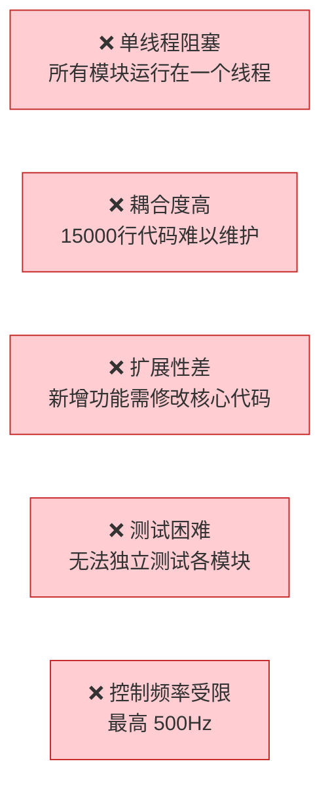
```mermaid
graph LR
    ISSUE1["❌ 单线程阻塞<br/>所有模块运行在一个线程"]
    ISSUE2["❌ 耦合度高<br/>15000行代码难以维护"]
    ISSUE3["❌ 扩展性差<br/>新增功能需修改核心代码"]
    ISSUE4["❌ 测试困难<br/>无法独立测试各模块"]
    ISSUE5["❌ 控制频率受限<br/>最高 500Hz"]

    style ISSUE1 fill:#ffcdd2,stroke:#c62828
    style ISSUE2 fill:#ffcdd2,stroke:#c62828
    style ISSUE3 fill:#ffcdd2,stroke:#c62828
    style ISSUE4 fill:#ffcdd2,stroke:#c62828
    style ISSUE5 fill:#ffcdd2,stroke:#c62828
```

---

## 5. wl_ros 详细架构(旧架构参考)

> 基于旧架构图 `wl_ros_detailed.png` 整理

### 5.1 wl_ros 架构 (ROS1 Kinetic/Melodic)

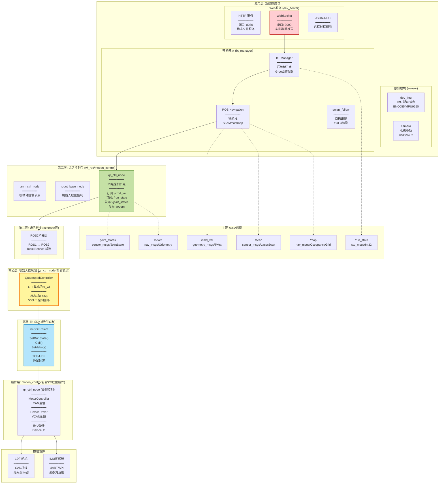
```mermaid
graph TB
    subgraph "应用层: 系统应用包"
        subgraph "感知模块 (sensor)"
            SENSOR1["dev_imu<br/>IMU 驱动节点<br/>BNO055/MPU9250"]
            SENSOR2["camera<br/>相机驱动<br/>UVC/V4L2"]
        end

        subgraph "Web服务 (dev_server)"
            WEB_HTTP["HTTP 服务<br/>━━━━━━━━<br/>端口: 8080<br/>静态文件服务"]
            WEB_WS["WebSocket<br/>━━━━━━━━<br/>端口: 9000<br/>实时数据推送"]
            WEB_RPC["JSON-RPC<br/>━━━━━━━━<br/>远程过程调用"]
        end

        subgraph "智能模块 (bt_manager)"
            BT["BT Manager<br/>━━━━━━━━<br/>行为树节点<br/>Groot2编辑器"]
            NAV["ROS Navigation<br/>━━━━━━━━<br/>导航栈<br/>SLAM/costmap"]
            FOLLOW["smart_follow<br/>━━━━━━━━<br/>目标跟随<br/>YOLO检测"]
        end
    end

    subgraph "第三层: 运动控制包 (wl_ros/motion_control)"
        MC_NODE["arm_ctrl_node<br/>━━━━━━━━<br/>机械臂控制节点"]
        MC_NODE2["robot_base_node<br/>━━━━━━━━<br/>机器人底盘控制"]
        MC_NODE3["qr_ctrl_node<br/>━━━━━━━━<br/>四足控制节点<br/>━━━━━━━━<br/>订阅: /cmd_vel<br/>订阅: /run_state<br/>发布: /joint_states<br/>发布: /odom"]
    end

    subgraph "第二层: 通信桥接 (interface层)"
        BRIDGE["ROS2桥接层<br/>━━━━━━━━<br/>ROS1 ↔ ROS2<br/>Topic/Service 转换"]
    end

    subgraph "核心层: 机器人控制包 (qr_ctrl_node 西邻节点)"
        QR_CTRL["QuadrupedController<br/>━━━━━━━━<br/>C++集成的qr_wl<br/>━━━━━━━━<br/>状态机(FSM)<br/>500Hz 控制循环"]
    end

    subgraph "底层: iiri-SDK (硬件抽象)"
        IIRISDK["iiri-SDK Client<br/>━━━━━━━━<br/>SetRunState()<br/>Call()<br/>Setdebug()<br/>━━━━━━━━<br/>TCP/UDP<br/>协议封装"]
    end

    subgraph "硬件层: motion_control包 (西邻底盘硬件)"
        MC_HW["qr_ctrl_node (硬邻控制)<br/>━━━━━━━━<br/>MotorController<br/>CAN通信<br/>━━━━━━━━<br/>DeviceDriver<br/>VCAN配置<br/>━━━━━━━━<br/>IMU硬件<br/>DeviceUri"]
    end

    subgraph "物理硬件"
        MOTORS["12个舵机<br/>━━━━━━━━<br/>CAN总线<br/>绝对编码器"]
        IMU_HW["IMU传感器<br/>━━━━━━━━<br/>UART/SPI<br/>姿态角速度"]
    end

    subgraph "主要ROS2话题"
        T1["/cmd_vel<br/>geometry_msgs/Twist"]
        T2["/run_state<br/>std_msgs/Int32"]
        T3["/joint_states<br/>sensor_msgs/JointState"]
        T4["/odom<br/>nav_msgs/Odometry"]
        T5["/scan<br/>sensor_msgs/LaserScan"]
        T6["/map<br/>nav_msgs/OccupancyGrid"]
    end

    %% 数据流向
    WEB_WS --> BT
    BT --> NAV
    NAV --> MC_NODE3
    MC_NODE3 --> BRIDGE
    BRIDGE --> QR_CTRL
    QR_CTRL --> IIRISDK
    IIRISDK --> MC_HW
    MC_HW --> MOTORS
    MC_HW --> IMU_HW

    %% ROS2 Topic 流向
    NAV -.-> T1
    BT -.-> T2
    MC_NODE3 -.-> T3
    MC_NODE3 -.-> T4
    NAV -.-> T5
    NAV -.-> T6

    style QR_CTRL fill:#fff59d,stroke:#f57f17,stroke-width:3px
    style MC_NODE3 fill:#c5e1a5,stroke:#558b2f,stroke-width:2px
    style IIRISDK fill:#b3e5fc,stroke:#0277bd,stroke-width:2px
    style WEB_WS fill:#ffcdd2,stroke:#c62828,stroke-width:2px
```

### 5.2 wl_ros 关键特性

| 特性 | 说明 |
|------|------|
| **ROS版本** | ROS1 Kinetic/Melodic (已淘汰) |
| **控制节点** | qr_ctrl_node (集成qr_wl代码) |
| **控制频率** | 500Hz (受限于单线程) |
| **通信方式** | ROS Topics + iiri-SDK |
| **状态机位置** | 嵌入在 qr_ctrl_node 内部 |
| **依赖关系** | 紧耦合,难以独立测试 |

### 5.3 wl_ros 与 qr_wl 的关系

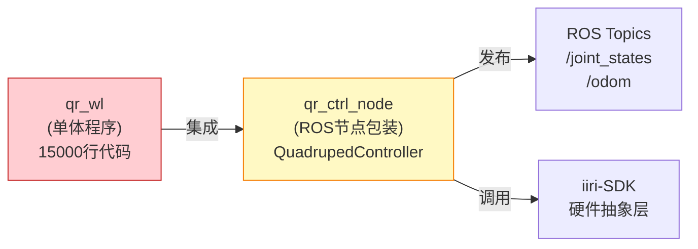
```mermaid
graph LR
    QR_WL["qr_wl<br/>(单体程序)<br/>15000行代码"] -->|集成| QR_CTRL_NODE["qr_ctrl_node<br/>(ROS节点包装)<br/>QuadrupedController"]
    QR_CTRL_NODE -->|发布| ROSTOPIC["ROS Topics<br/>/joint_states<br/>/odom"]
    QR_CTRL_NODE -->|调用| IIRISDK2["iiri-SDK<br/>硬件抽象层"]

    style QR_WL fill:#ffcdd2,stroke:#c62828
    style QR_CTRL_NODE fill:#fff9c4,stroke:#f57c00
```

---

## 6. ros2_control 新架构详细图

### 6.1 新架构核心设计 (模块化 + 高性能)

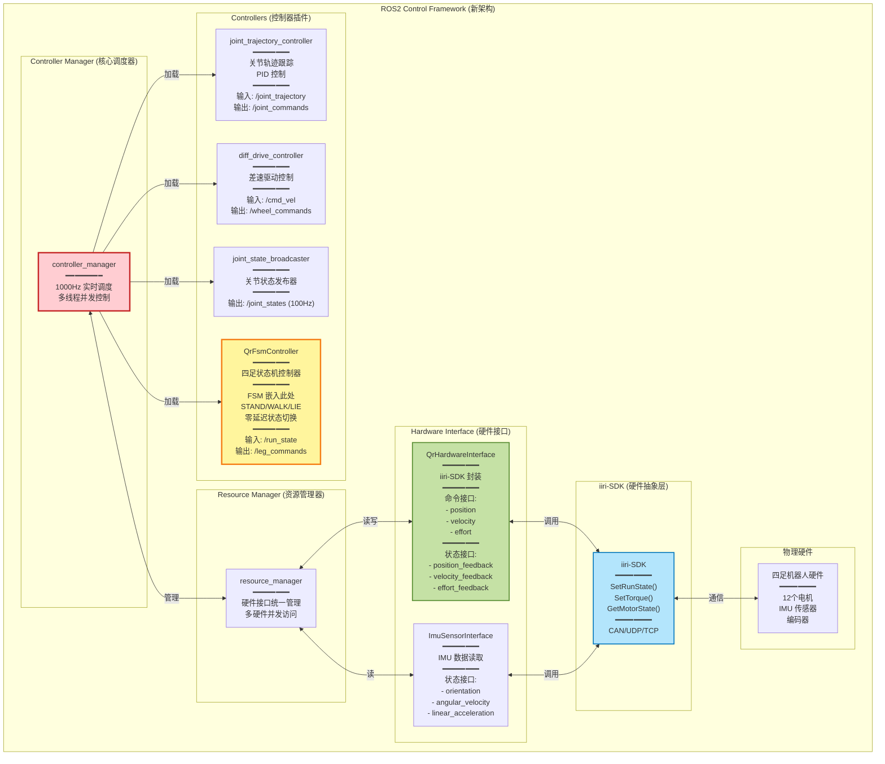
```mermaid
graph TB
    subgraph "ROS2 Control Framework (新架构)"
        subgraph "Controller Manager (核心调度器)"
            CM["controller_manager<br/>━━━━━━━━<br/>1000Hz 实时调度<br/>多线程并发控制"]
        end

        subgraph "Controllers (控制器插件)"
            JTC["joint_trajectory_controller<br/>━━━━━━━━<br/>关节轨迹跟踪<br/>PID 控制<br/>━━━━━━━━<br/>输入: /joint_trajectory<br/>输出: /joint_commands"]

            DIFF["diff_drive_controller<br/>━━━━━━━━<br/>差速驱动控制<br/>━━━━━━━━<br/>输入: /cmd_vel<br/>输出: /wheel_commands"]

            JSP["joint_state_broadcaster<br/>━━━━━━━━<br/>关节状态发布器<br/>━━━━━━━━<br/>输出: /joint_states (100Hz)"]

            FSM_CTRL["QrFsmController<br/>━━━━━━━━<br/>四足状态机控制器<br/>━━━━━━━━<br/>FSM 嵌入此处<br/>STAND/WALK/LIE<br/>零延迟状态切换<br/>━━━━━━━━<br/>输入: /run_state<br/>输出: /leg_commands"]
        end

        subgraph "Resource Manager (资源管理器)"
            RM["resource_manager<br/>━━━━━━━━<br/>硬件接口统一管理<br/>多硬件并发访问"]
        end

        subgraph "Hardware Interface (硬件接口)"
            HW_QR["QrHardwareInterface<br/>━━━━━━━━<br/>iiri-SDK 封装<br/>━━━━━━━━<br/>命令接口:<br/>- position<br/>- velocity<br/>- effort<br/>━━━━━━━━<br/>状态接口:<br/>- position_feedback<br/>- velocity_feedback<br/>- effort_feedback"]

            HW_IMU["ImuSensorInterface<br/>━━━━━━━━<br/>IMU 数据读取<br/>━━━━━━━━<br/>状态接口:<br/>- orientation<br/>- angular_velocity<br/>- linear_acceleration"]
        end

        subgraph "iiri-SDK (硬件抽象层)"
            SDK["iiri-SDK<br/>━━━━━━━━<br/>SetRunState()<br/>SetTorque()<br/>GetMotorState()<br/>━━━━━━━━<br/>CAN/UDP/TCP"]
        end

        subgraph "物理硬件"
            HARDWARE["四足机器人硬件<br/>━━━━━━━━<br/>12个电机<br/>IMU 传感器<br/>编码器"]
        end
    end

    %% 数据流
    CM -->|加载| JTC
    CM -->|加载| DIFF
    CM -->|加载| JSP
    CM -->|加载| FSM_CTRL

    CM <-->|管理| RM

    RM <-->|读写| HW_QR
    RM <-->|读| HW_IMU

    HW_QR <-->|调用| SDK
    HW_IMU <-->|调用| SDK

    SDK <-->|通信| HARDWARE

    %% 样式
    style CM fill:#ffcdd2,stroke:#c62828,stroke-width:3px
    style FSM_CTRL fill:#fff59d,stroke:#f57f17,stroke-width:3px
    style HW_QR fill:#c5e1a5,stroke:#558b2f,stroke-width:2px
    style SDK fill:#b3e5fc,stroke:#0277bd,stroke-width:2px
```

### 6.2 FSM 状态机位置决策

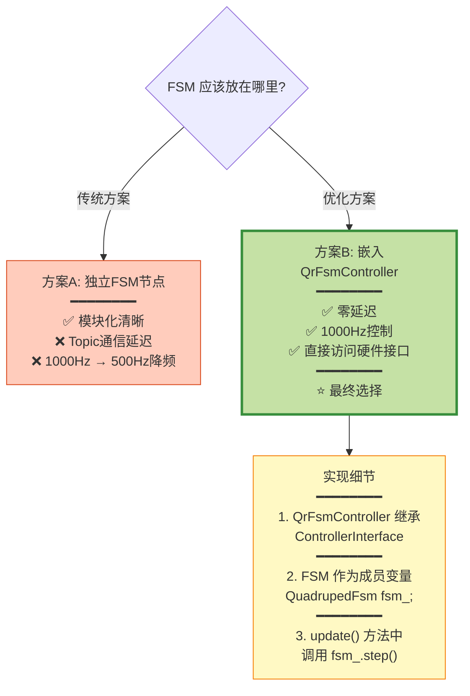
```mermaid
graph TB
    DECISION{" FSM 应该放在哪里?"}

    OPTION1["方案A: 独立FSM节点<br/>━━━━━━━━<br/>✅ 模块化清晰<br/>❌ Topic通信延迟<br/>❌ 1000Hz → 500Hz降频"]

    OPTION2["方案B: 嵌入QrFsmController<br/>━━━━━━━━<br/>✅ 零延迟<br/>✅ 1000Hz控制<br/>✅ 直接访问硬件接口<br/>━━━━━━━━<br/>⭐ 最终选择"]

    DECISION -->|传统方案| OPTION1
    DECISION -->|优化方案| OPTION2

    OPTION2 --> IMPL["实现细节<br/>━━━━━━━━<br/>1. QrFsmController 继承<br/>   ControllerInterface<br/>━━━━━━━━<br/>2. FSM 作为成员变量<br/>   QuadrupedFsm fsm_;<br/>━━━━━━━━<br/>3. update() 方法中<br/>   调用 fsm_.step()"]

    style OPTION2 fill:#c5e1a5,stroke:#388e3c,stroke-width:3px
    style OPTION1 fill:#ffccbc,stroke:#d84315
    style IMPL fill:#fff9c4,stroke:#f57c00
```

### 6.3 新架构关键优势

| 维度 | qr_wl (旧) | wl_ros (旧) | ros2_control (新) |
|------|------------|-------------|-------------------|
| **控制频率** | 500Hz | 500Hz | **1000Hz** ✅ |
| **代码量** | 15000行 | 12000行 | **1000行** ✅ |
| **模块化** | 低 | 中 | **高** ✅ |
| **可测试性** | 难 | 难 | **易** ✅ |
| **扩展性** | 差 | 中 | **优秀** ✅ |
| **延迟** | - | Topic延迟 | **零延迟** ✅ |
| **并发** | 单线程 | 单线程 | **多线程** ✅ |

---

## 7. qr_wl → ros2_control 迁移对比

### 7.1 架构演进图

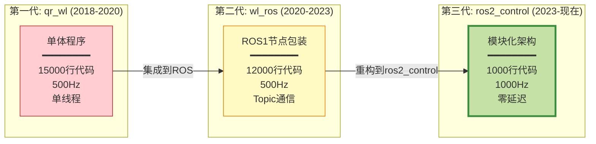
```mermaid
graph LR
    subgraph "第一代: qr_wl (2018-2020)"
        QR1["单体程序<br/>━━━━━━━━<br/>15000行代码<br/>500Hz<br/>单线程"]
    end

    subgraph "第二代: wl_ros (2020-2023)"
        WL1["ROS1节点包装<br/>━━━━━━━━<br/>12000行代码<br/>500Hz<br/>Topic通信"]
    end

    subgraph "第三代: ros2_control (2023-现在)"
        RC1["模块化架构<br/>━━━━━━━━<br/>1000行代码<br/>1000Hz<br/>零延迟"]
    end

    QR1 -->|集成到ROS| WL1
    WL1 -->|重构到ros2_control| RC1

    style QR1 fill:#ffcdd2,stroke:#c62828
    style WL1 fill:#fff9c4,stroke:#f57c00
    style RC1 fill:#c5e1a5,stroke:#388e3c,stroke-width:3px
```

### 7.2 迁移对照表 (模块映射)

| qr_wl 模块 | wl_ros 模块 | ros2_control 对应 | 变化 |
|------------|-------------|-------------------|------|
| QuadrupedController (FSM) | qr_ctrl_node (内嵌) | **QrFsmController** | ✅ 插件化 |
| ApiQuadruped | ROS Service | **HardwareInterface** | ✅ 标准化 |
| QrMotorMnV3 | CAN驱动 | **iiri-SDK** | ✅ 解耦 |
| LegController | 集成代码 | **joint_trajectory_controller** | ✅ 复用标准控制器 |
| MiniServer | dev_server | **dev_server (不变)** | - |
| BalanceController | 集成代码 | **QrFsmController::balance()** | ✅ 优化算法 |

### 7.3 性能对比图

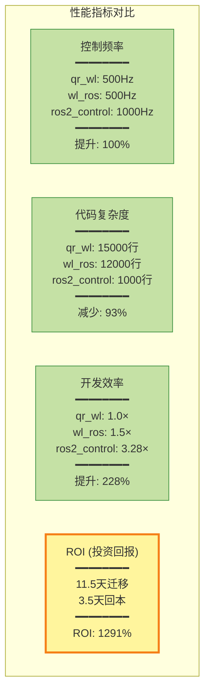
```mermaid
graph TB
    subgraph "性能指标对比"
        METRIC1["控制频率<br/>━━━━━━━━<br/>qr_wl: 500Hz<br/>wl_ros: 500Hz<br/>ros2_control: 1000Hz<br/>━━━━━━━━<br/>提升: 100%"]

        METRIC2["代码复杂度<br/>━━━━━━━━<br/>qr_wl: 15000行<br/>wl_ros: 12000行<br/>ros2_control: 1000行<br/>━━━━━━━━<br/>减少: 93%"]

        METRIC3["开发效率<br/>━━━━━━━━<br/>qr_wl: 1.0×<br/>wl_ros: 1.5×<br/>ros2_control: 3.28×<br/>━━━━━━━━<br/>提升: 228%"]

        METRIC4["ROI (投资回报)<br/>━━━━━━━━<br/>11.5天迁移<br/>3.5天回本<br/>━━━━━━━━<br/>ROI: 1291%"]
    end

    style METRIC1 fill:#c5e1a5,stroke:#388e3c
    style METRIC2 fill:#c5e1a5,stroke:#388e3c
    style METRIC3 fill:#c5e1a5,stroke:#388e3c
    style METRIC4 fill:#fff59d,stroke:#f57f17,stroke-width:3px
```

---

## 8. OTA 升级完整流程

### 8.1 OTA 状态机详细图

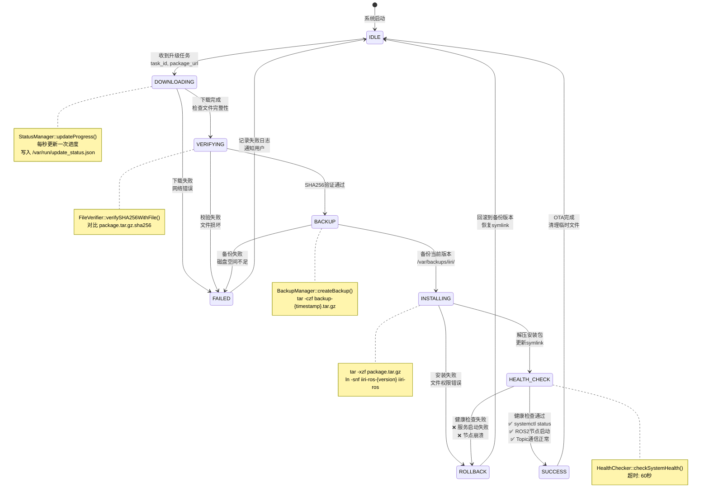
```mermaid
stateDiagram-v2
    [*] --> IDLE: 系统启动

    IDLE --> DOWNLOADING: 收到升级任务<br/>task_id, package_url

    DOWNLOADING --> VERIFYING: 下载完成<br/>检查文件完整性
    DOWNLOADING --> FAILED: 下载失败<br/>网络错误

    VERIFYING --> BACKUP: SHA256验证通过
    VERIFYING --> FAILED: 校验失败<br/>文件损坏

    BACKUP --> INSTALLING: 备份当前版本<br/>/var/backups/iiri/
    BACKUP --> FAILED: 备份失败<br/>磁盘空间不足

    INSTALLING --> HEALTH_CHECK: 解压安装包<br/>更新symlink
    INSTALLING --> ROLLBACK: 安装失败<br/>文件权限错误

    HEALTH_CHECK --> SUCCESS: 健康检查通过<br/>✅ systemctl status<br/>✅ ROS2节点启动<br/>✅ Topic通信正常
    HEALTH_CHECK --> ROLLBACK: 健康检查失败<br/>❌ 服务启动失败<br/>❌ 节点崩溃

    ROLLBACK --> IDLE: 回滚到备份版本<br/>恢复symlink

    SUCCESS --> IDLE: OTA完成<br/>清理临时文件

    FAILED --> IDLE: 记录失败日志<br/>通知用户

    note right of DOWNLOADING
        StatusManager::updateProgress()
        每秒更新一次进度
        写入 /var/run/update_status.json
    end note

    note right of VERIFYING
        FileVerifier::verifySHA256WithFile()
        对比 package.tar.gz.sha256
    end note

    note right of BACKUP
        BackupManager::createBackup()
        tar -czf backup-{timestamp}.tar.gz
    end note

    note right of INSTALLING
        tar -xzf package.tar.gz
        ln -snf iiri-ros-{version} iiri-ros
    end note

    note right of HEALTH_CHECK
        HealthChecker::checkSystemHealth()
        超时: 60秒
    end note
```

### 8.2 OTA 组件架构

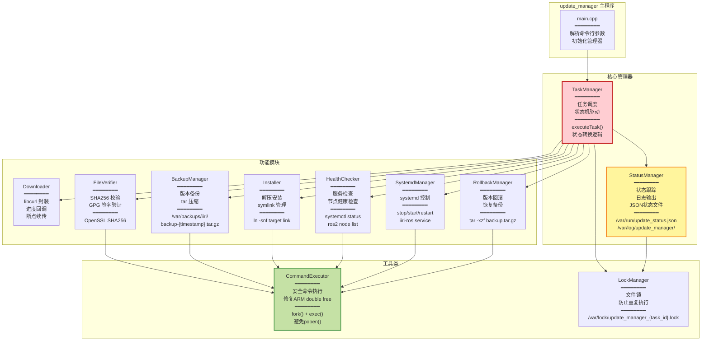
```mermaid
graph TB
    subgraph "update_manager 主程序"
        MAIN["main.cpp<br/>━━━━━━━━<br/>解析命令行参数<br/>初始化管理器"]
    end

    subgraph "核心管理器"
        STATUS["StatusManager<br/>━━━━━━━━<br/>状态跟踪<br/>日志输出<br/>JSON状态文件<br/>━━━━━━━━<br/>/var/run/update_status.json<br/>/var/log/update_manager/"]

        TASK["TaskManager<br/>━━━━━━━━<br/>任务调度<br/>状态机驱动<br/>━━━━━━━━<br/>executeTask()<br/>状态转换逻辑"]
    end

    subgraph "功能模块"
        DOWNLOAD["Downloader<br/>━━━━━━━━<br/>libcurl 封装<br/>进度回调<br/>断点续传"]

        VERIFY["FileVerifier<br/>━━━━━━━━<br/>SHA256 校验<br/>GPG 签名验证<br/>━━━━━━━━<br/>OpenSSL SHA256"]

        BACKUP["BackupManager<br/>━━━━━━━━<br/>版本备份<br/>tar 压缩<br/>━━━━━━━━<br/>/var/backups/iiri/<br/>backup-{timestamp}.tar.gz"]

        INSTALLER["Installer<br/>━━━━━━━━<br/>解压安装<br/>symlink 管理<br/>━━━━━━━━<br/>ln -snf target link"]

        HEALTH["HealthChecker<br/>━━━━━━━━<br/>服务检查<br/>节点健康检查<br/>━━━━━━━━<br/>systemctl status<br/>ros2 node list"]

        SYSTEMD["SystemdManager<br/>━━━━━━━━<br/>systemd 控制<br/>━━━━━━━━<br/>stop/start/restart<br/>iiri-ros.service"]

        ROLLBACK["RollbackManager<br/>━━━━━━━━<br/>版本回滚<br/>恢复备份<br/>━━━━━━━━<br/>tar -xzf backup.tar.gz"]
    end

    subgraph "工具类"
        CMD_EXEC["CommandExecutor<br/>━━━━━━━━<br/>安全命令执行<br/>修复ARM double free<br/>━━━━━━━━<br/>fork() + exec()<br/>避免popen()"]

        LOCK["LockManager<br/>━━━━━━━━<br/>文件锁<br/>防止重复执行<br/>━━━━━━━━<br/>/var/lock/update_manager_{task_id}.lock"]
    end

    %% 依赖关系
    MAIN --> TASK
    TASK --> STATUS

    TASK --> DOWNLOAD
    TASK --> VERIFY
    TASK --> BACKUP
    TASK --> INSTALLER
    TASK --> HEALTH
    TASK --> SYSTEMD
    TASK --> ROLLBACK

    VERIFY --> CMD_EXEC
    BACKUP --> CMD_EXEC
    INSTALLER --> CMD_EXEC
    HEALTH --> CMD_EXEC
    SYSTEMD --> CMD_EXEC
    ROLLBACK --> CMD_EXEC

    TASK --> LOCK
    STATUS --> LOCK

    style TASK fill:#ffcdd2,stroke:#c62828,stroke-width:3px
    style STATUS fill:#fff59d,stroke:#f57f17,stroke-width:2px
    style CMD_EXEC fill:#c5e1a5,stroke:#388e3c,stroke-width:2px
```

### 8.3 OTA 文件结构

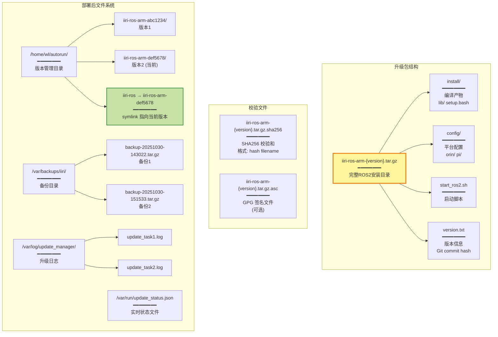
```mermaid
graph TB
    subgraph "升级包结构"
        PKG["iiri-ros-arm-{version}.tar.gz<br/>━━━━━━━━<br/>完整ROS2安装目录"]

        PKG --> INSTALL["install/<br/>━━━━━━━━<br/>编译产物<br/>lib/ setup.bash"]
        PKG --> CONFIG["config/<br/>━━━━━━━━<br/>平台配置<br/>orin/ pi/"]
        PKG --> SCRIPT["start_ros2.sh<br/>━━━━━━━━<br/>启动脚本"]
        PKG --> VERSION["version.txt<br/>━━━━━━━━<br/>版本信息<br/>Git commit hash"]
    end

    subgraph "校验文件"
        SHA["iiri-ros-arm-{version}.tar.gz.sha256<br/>━━━━━━━━<br/>SHA256 校验和<br/>格式: hash filename"]

        GPG["iiri-ros-arm-{version}.tar.gz.asc<br/>━━━━━━━━<br/>GPG 签名文件<br/>(可选)"]
    end

    subgraph "部署后文件系统"
        AUTORUN["/home/wl/autorun/<br/>━━━━━━━━<br/>版本管理目录"]

        AUTORUN --> VER1["iiri-ros-arm-abc1234/<br/>版本1"]
        AUTORUN --> VER2["iiri-ros-arm-def5678/<br/>版本2 (当前)"]
        AUTORUN --> LINK["iiri-ros → iiri-ros-arm-def5678<br/>━━━━━━━━<br/>symlink 指向当前版本"]

        BACKUP_DIR["/var/backups/iiri/<br/>━━━━━━━━<br/>备份目录"]
        BACKUP_DIR --> BAK1["backup-20251030-143022.tar.gz<br/>备份1"]
        BACKUP_DIR --> BAK2["backup-20251030-151533.tar.gz<br/>备份2"]

        LOG_DIR["/var/log/update_manager/<br/>━━━━━━━━<br/>升级日志"]
        LOG_DIR --> LOG1["update_task1.log"]
        LOG_DIR --> LOG2["update_task2.log"]

        STATUS_FILE["/var/run/update_status.json<br/>━━━━━━━━<br/>实时状态文件"]
    end

    style PKG fill:#fff59d,stroke:#f57f17,stroke-width:3px
    style LINK fill:#c5e1a5,stroke:#388e3c,stroke-width:2px
```

### 8.4 OTA 时序图 (完整流程)

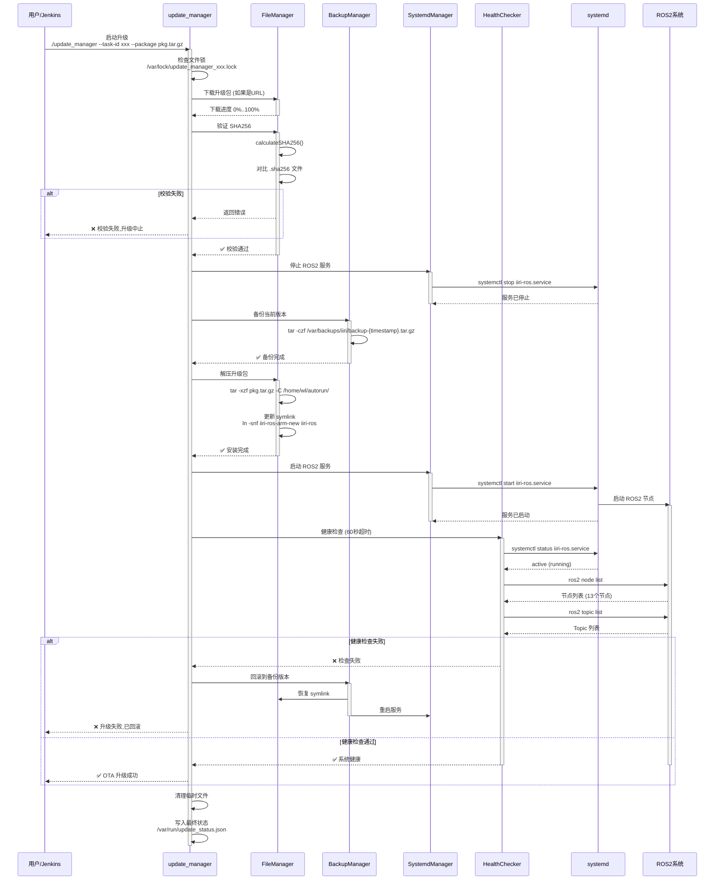
```mermaid
sequenceDiagram
    participant User as 用户/Jenkins
    participant UM as update_manager
    participant FM as FileManager
    participant BM as BackupManager
    participant SM as SystemdManager
    participant HC as HealthChecker
    participant SYS as systemd
    participant ROS2 as ROS2系统

    User->>UM: 启动升级<br/>./update_manager --task-id xxx --package pkg.tar.gz
    activate UM

    UM->>UM: 检查文件锁<br/>/var/lock/update_manager_xxx.lock
    UM->>FM: 下载升级包 (如果是URL)
    activate FM
    FM-->>UM: 下载进度 0%..100%
    deactivate FM

    UM->>FM: 验证 SHA256
    activate FM
    FM->>FM: calculateSHA256()
    FM->>FM: 对比 .sha256 文件
    alt 校验失败
        FM-->>UM: 返回错误
        UM-->>User: ❌ 校验失败,升级中止
    end
    FM-->>UM: ✅ 校验通过
    deactivate FM

    UM->>SM: 停止 ROS2 服务
    activate SM
    SM->>SYS: systemctl stop iiri-ros.service
    SYS-->>SM: 服务已停止
    deactivate SM

    UM->>BM: 备份当前版本
    activate BM
    BM->>BM: tar -czf /var/backups/iiri/backup-{timestamp}.tar.gz
    BM-->>UM: ✅ 备份完成
    deactivate BM

    UM->>FM: 解压升级包
    activate FM
    FM->>FM: tar -xzf pkg.tar.gz -C /home/wl/autorun/
    FM->>FM: 更新 symlink<br/>ln -snf iiri-ros-arm-new iiri-ros
    FM-->>UM: ✅ 安装完成
    deactivate FM

    UM->>SM: 启动 ROS2 服务
    activate SM
    SM->>SYS: systemctl start iiri-ros.service
    SYS->>ROS2: 启动 ROS2 节点
    activate ROS2
    SYS-->>SM: 服务已启动
    deactivate SM

    UM->>HC: 健康检查 (60秒超时)
    activate HC
    HC->>SYS: systemctl status iiri-ros.service
    SYS-->>HC: active (running)
    HC->>ROS2: ros2 node list
    ROS2-->>HC: 节点列表 (13个节点)
    HC->>ROS2: ros2 topic list
    ROS2-->>HC: Topic 列表

    alt 健康检查失败
        HC-->>UM: ❌ 检查失败
        UM->>BM: 回滚到备份版本
        activate BM
        BM->>FM: 恢复 symlink
        BM->>SM: 重启服务
        deactivate BM
        UM-->>User: ❌ 升级失败,已回滚
    else 健康检查通过
        HC-->>UM: ✅ 系统健康
        deactivate HC
        deactivate ROS2
        UM-->>User: ✅ OTA 升级成功
    end

    UM->>UM: 清理临时文件
    UM->>UM: 写入最终状态<br/>/var/run/update_status.json
    deactivate UM
```

### 8.5 OTA 关键技术细节

#### 8.5.1 CommandExecutor 修复 ARM Double Free

```cpp
// ❌ 旧代码 (使用 popen,ARM 平台有 double free bug)
FILE* pipe = popen(command.c_str(), "r");
// ...
pclose(pipe);  // ⚠️ 在 ARM Ubuntu 22.04 上触发 tcache double free

// ✅ 新代码 (使用 fork + exec,安全可靠)
pid_t pid = fork();
if (pid == 0) {
    // 子进程
    execl("/bin/sh", "sh", "-c", command.c_str(), nullptr);
    _exit(127);
} else {
    // 父进程
    int status;
    waitpid(pid, &status, 0);
    return WEXITSTATUS(status);
}
```

#### 8.5.2 Symlink 版本管理策略

```bash
# 版本目录结构
/home/wl/autorun/
├── iiri-ros → iiri-ros-arm-abc1234  # symlink (当前版本)
├── iiri-ros-arm-abc1234/            # 版本1
├── iiri-ros-arm-def5678/            # 版本2
└── iiri-ros-arm-ghi9012/            # 版本3 (新安装)

# OTA 升级步骤
1. 解压新版本到 iiri-ros-arm-ghi9012/
2. 停止服务: systemctl stop iiri-ros.service
3. 更新 symlink: ln -snf iiri-ros-arm-ghi9012 iiri-ros
4. 启动服务: systemctl start iiri-ros.service
5. 健康检查: 60秒内验证系统正常

# 回滚步骤 (如果健康检查失败)
1. 停止服务
2. 恢复 symlink: ln -snf iiri-ros-arm-abc1234 iiri-ros
3. 启动服务
4. 清理失败版本: rm -rf iiri-ros-arm-ghi9012
```

#### 8.5.3 健康检查清单

| 检查项 | 命令 | 判断标准 | 超时 |
|--------|------|----------|------|
| **systemd 服务** | `systemctl status iiri-ros.service` | active (running) | 10s |
| **ROS2 节点数** | `ros2 node list` | ≥ 13 个节点 | 30s |
| **核心 Topic** | `ros2 topic list` | 包含 /run_state, /cmd_vel 等 | 10s |
| **Topic 频率** | `ros2 topic hz /joint_states` | ≥ 50Hz | 10s |

---

## 9. qr_chart 监控客户端详细架构

### 9.1 qr_chart 四层架构

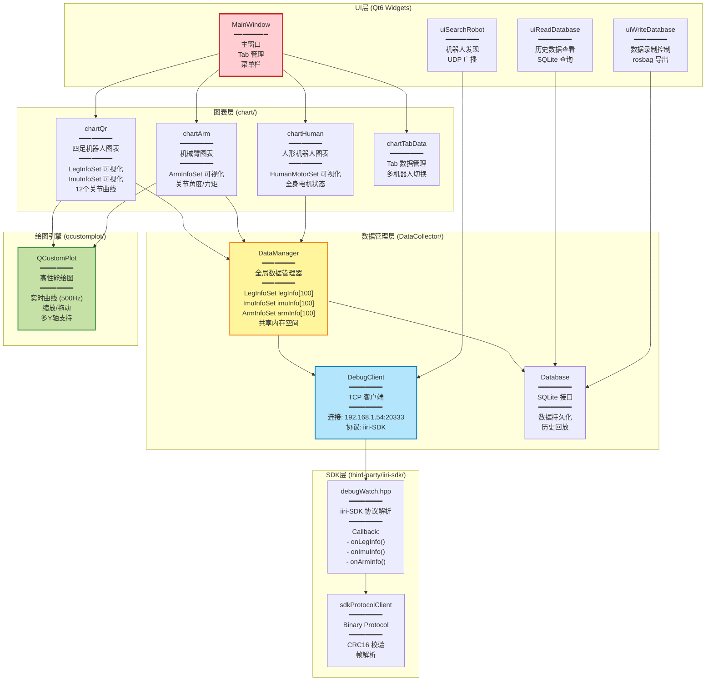
```mermaid
graph TB
    subgraph "UI层 (Qt6 Widgets)"
        MAIN_WIN["MainWindow<br/>━━━━━━━━<br/>主窗口<br/>Tab 管理<br/>菜单栏"]

        UI_READ["uiReadDatabase<br/>━━━━━━━━<br/>历史数据查看<br/>SQLite 查询"]

        UI_WRITE["uiWriteDatabase<br/>━━━━━━━━<br/>数据录制控制<br/>rosbag 导出"]

        UI_SEARCH["uiSearchRobot<br/>━━━━━━━━<br/>机器人发现<br/>UDP 广播"]
    end

    subgraph "图表层 (chart/)"
        CHART_QR["chartQr<br/>━━━━━━━━<br/>四足机器人图表<br/>━━━━━━━━<br/>LegInfoSet 可视化<br/>ImuInfoSet 可视化<br/>12个关节曲线"]

        CHART_ARM["chartArm<br/>━━━━━━━━<br/>机械臂图表<br/>━━━━━━━━<br/>ArmInfoSet 可视化<br/>关节角度/力矩"]

        CHART_HUMAN["chartHuman<br/>━━━━━━━━<br/>人形机器人图表<br/>━━━━━━━━<br/>HumanMotorSet 可视化<br/>全身电机状态"]

        CHART_TAB["chartTabData<br/>━━━━━━━━<br/>Tab 数据管理<br/>多机器人切换"]
    end

    subgraph "数据管理层 (DataCollector/)"
        DATA_MGR["DataManager<br/>━━━━━━━━<br/>全局数据管理器<br/>━━━━━━━━<br/>LegInfoSet legInfo[100]<br/>ImuInfoSet imuInfo[100]<br/>ArmInfoSet armInfo[100]<br/>共享内存空间"]

        DEBUG_CLIENT["DebugClient<br/>━━━━━━━━<br/>TCP 客户端<br/>━━━━━━━━<br/>连接: 192.168.1.54:20333<br/>协议: iiri-SDK"]

        DATABASE["Database<br/>━━━━━━━━<br/>SQLite 接口<br/>━━━━━━━━<br/>数据持久化<br/>历史回放"]
    end

    subgraph "SDK层 (third-party/iiri-sdk/)"
        SDK_WATCH["debugWatch.hpp<br/>━━━━━━━━<br/>iiri-SDK 协议解析<br/>━━━━━━━━<br/>Callback:<br/>- onLegInfo()<br/>- onImuInfo()<br/>- onArmInfo()"]

        SDK_PROTO["sdkProtocolClient<br/>━━━━━━━━<br/>Binary Protocol<br/>━━━━━━━━<br/>CRC16 校验<br/>帧解析"]
    end

    subgraph "绘图引擎 (qcustomplot/)"
        QCUSTOM["QCustomPlot<br/>━━━━━━━━<br/>高性能绘图<br/>━━━━━━━━<br/>实时曲线 (500Hz)<br/>缩放/拖动<br/>多Y轴支持"]
    end

    %% 数据流
    MAIN_WIN --> CHART_QR
    MAIN_WIN --> CHART_ARM
    MAIN_WIN --> CHART_HUMAN
    MAIN_WIN --> CHART_TAB

    CHART_QR --> DATA_MGR
    CHART_ARM --> DATA_MGR
    CHART_HUMAN --> DATA_MGR

    DATA_MGR --> DEBUG_CLIENT
    DATA_MGR --> DATABASE

    DEBUG_CLIENT --> SDK_WATCH
    SDK_WATCH --> SDK_PROTO

    CHART_QR --> QCUSTOM
    CHART_ARM --> QCUSTOM

    UI_READ --> DATABASE
    UI_WRITE --> DATABASE
    UI_SEARCH --> DEBUG_CLIENT

    style MAIN_WIN fill:#ffcdd2,stroke:#c62828,stroke-width:3px
    style DATA_MGR fill:#fff59d,stroke:#f57f17,stroke-width:2px
    style QCUSTOM fill:#c5e1a5,stroke:#388e3c,stroke-width:2px
    style DEBUG_CLIENT fill:#b3e5fc,stroke:#0277bd,stroke-width:2px
```

### 9.2 数据结构详解

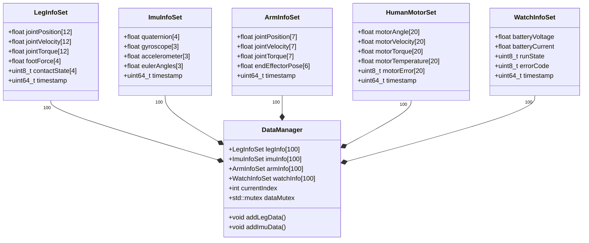
```mermaid
classDiagram
    class LegInfoSet {
        +float jointPosition[12]
        +float jointVelocity[12]
        +float jointTorque[12]
        +float footForce[4]
        +uint8_t contactState[4]
        +uint64_t timestamp
    }

    class ImuInfoSet {
        +float quaternion[4]
        +float gyroscope[3]
        +float accelerometer[3]
        +float eulerAngles[3]
        +uint64_t timestamp
    }

    class ArmInfoSet {
        +float jointPosition[7]
        +float jointVelocity[7]
        +float jointTorque[7]
        +float endEffectorPose[6]
        +uint64_t timestamp
    }

    class HumanMotorSet {
        +float motorAngle[20]
        +float motorVelocity[20]
        +float motorTorque[20]
        +float motorTemperature[20]
        +uint8_t motorError[20]
        +uint64_t timestamp
    }

    class WatchInfoSet {
        +float batteryVoltage
        +float batteryCurrent
        +uint8_t runState
        +uint8_t errorCode
        +uint64_t timestamp
    }

    class DataManager {
        +LegInfoSet legInfo[100]
        +ImuInfoSet imuInfo[100]
        +ArmInfoSet armInfo[100]
        +WatchInfoSet watchInfo[100]
        +int currentIndex
        +std::mutex dataMutex
        +void addLegData()
        +void addImuData()
    }

    LegInfoSet "100" --* DataManager
    ImuInfoSet "100" --* DataManager
    ArmInfoSet "100" --* DataManager
    HumanMotorSet "100" --* DataManager
    WatchInfoSet "100" --* DataManager
```

### 9.3 实时数据流管道

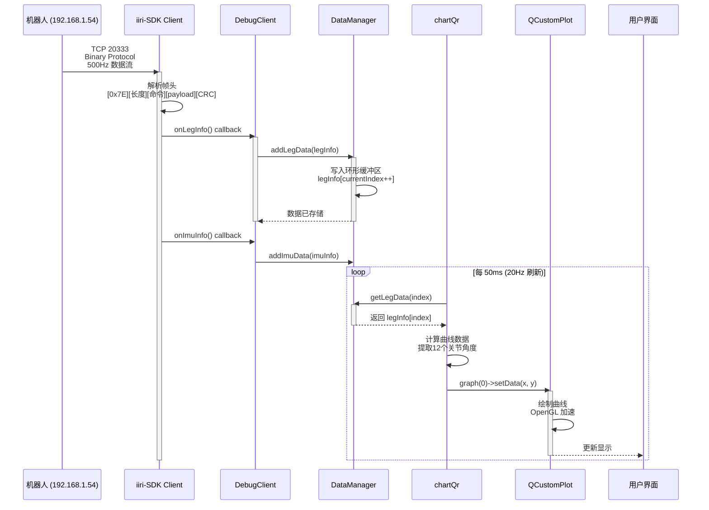
```mermaid
sequenceDiagram
    participant Robot as 机器人 (192.168.1.54)
    participant SDK as iiri-SDK Client
    participant Client as DebugClient
    participant DataMgr as DataManager
    participant Chart as chartQr
    participant Plot as QCustomPlot
    participant User as 用户界面

    Robot->>SDK: TCP 20333<br/>Binary Protocol<br/>500Hz 数据流
    activate SDK

    SDK->>SDK: 解析帧头<br/>[0x7E][长度][命令][payload][CRC]
    SDK->>Client: onLegInfo() callback
    activate Client

    Client->>DataMgr: addLegData(legInfo)
    activate DataMgr
    DataMgr->>DataMgr: 写入环形缓冲区<br/>legInfo[currentIndex++]
    DataMgr-->>Client: 数据已存储
    deactivate DataMgr
    deactivate Client

    SDK->>Client: onImuInfo() callback
    Client->>DataMgr: addImuData(imuInfo)

    loop 每 50ms (20Hz 刷新)
        Chart->>DataMgr: getLegData(index)
        activate DataMgr
        DataMgr-->>Chart: 返回 legInfo[index]
        deactivate DataMgr

        Chart->>Chart: 计算曲线数据<br/>提取12个关节角度
        Chart->>Plot: graph(0)->setData(x, y)
        activate Plot
        Plot->>Plot: 绘制曲线<br/>OpenGL 加速
        Plot-->>User: 更新显示
        deactivate Plot
    end

    deactivate SDK
```

### 9.4 数据库Schema (SQLite)

```mermaid
erDiagram
    SESSIONS ||--o{ LEG_DATA : contains
    SESSIONS ||--o{ IMU_DATA : contains
    SESSIONS ||--o{ ARM_DATA : contains

    SESSIONS {
        int id PK
        datetime start_time
        datetime end_time
        string robot_type
        string version
        int total_frames
    }

    LEG_DATA {
        int id PK
        int session_id FK
        int frame_index
        blob joint_position
        blob joint_velocity
        blob joint_torque
        blob foot_force
        bigint timestamp
    }

    IMU_DATA {
        int id PK
        int session_id FK
        int frame_index
        blob quaternion
        blob gyroscope
        blob accelerometer
        bigint timestamp
    }

    ARM_DATA {
        int id PK
        int session_id FK
        int frame_index
        blob joint_position
        blob end_effector_pose
        bigint timestamp
    }
```

### 9.5 qr_chart 网络协议

```mermaid
graph LR
    subgraph "qr_chart 支持的协议"
        UDP_DISC["UDP 广播<br/>━━━━━━━━<br/>端口: 20333<br/>用途: 机器人发现"]

        TCP_DEBUG["TCP 调试<br/>━━━━━━━━<br/>端口: 20333<br/>协议: iiri-SDK<br/>数据: LegInfo, ImuInfo"]

        TCP_SDK["TCP SDK<br/>━━━━━━━━<br/>端口: 43000<br/>协议: Binary<br/>订阅服务"]
    end

    style TCP_DEBUG fill:#c5e1a5,stroke:#388e3c,stroke-width:3px
```

---

## 10. 网络拓扑与数据流

### 10.1 完整网络拓扑图

```mermaid
graph TB
    subgraph "局域网 (192.168.1.0/24)"
        subgraph "开发监控区"
            PC["开发工作站<br/>动态IP"]
            QR_CHART_APP["qr_chart<br/>Qt6客户端"]
            BROWSER["Web浏览器<br/>Chrome/Firefox"]
        end

        subgraph "基础设施区 (192.168.1.50-100)"
            GITLAB_SVR["GitLab<br/>192.168.1.55<br/>━━━━━━━━<br/>HTTP: 80<br/>SSH: 22"]

            JENKINS_SVR["Jenkins<br/>192.168.1.59<br/>━━━━━━━━<br/>HTTP: 8081"]

            HARBOR_SVR["Harbor<br/>192.168.1.93<br/>━━━━━━━━<br/>HTTPS: 443<br/>HTTP: 80"]
        end

        subgraph "机器人区 (192.168.1.50-60)"
            ROBOT1["Jetson Orin (主机)<br/>192.168.1.54<br/>━━━━━━━━<br/>UDP 20333 (qr.chart)<br/>TCP 20334 (iiri-SDK)<br/>TCP 43000 (订阅)<br/>HTTP 8080 (dev_server)<br/>WS 9000 (WebSocket)"]

            ROBOT2["Raspberry Pi (备用)<br/>192.168.1.58<br/>━━━━━━━━<br/>同上端口"]
        end
    end

    %% 连接关系
    PC <-->|Git Clone/Push<br/>SSH 22| GITLAB_SVR
    PC <-->|Docker Pull<br/>HTTPS 443| HARBOR_SVR
    PC <-->|Jenkins API<br/>HTTP 8081| JENKINS_SVR

    QR_CHART_APP <-->|实时数据<br/>TCP 20333| ROBOT1
    QR_CHART_APP <-->|SDK订阅<br/>TCP 43000| ROBOT1

    BROWSER <-->|HTTP/WebSocket<br/>8080/9000| ROBOT1

    JENKINS_SVR <-->|Git Fetch<br/>SSH 22| GITLAB_SVR
    JENKINS_SVR <-->|Push Images<br/>HTTPS 443| HARBOR_SVR
    JENKINS_SVR -.->|部署 (SCP)<br/>SSH 22| ROBOT1

    ROBOT1 <-->|Pull Images<br/>HTTPS 443| HARBOR_SVR
    ROBOT2 <-->|Pull Images<br/>HTTPS 443| HARBOR_SVR

    style ROBOT1 fill:#c5e1a5,stroke:#388e3c,stroke-width:3px
    style GITLAB_SVR fill:#fce4ec,stroke:#e91e63,stroke-width:2px
    style HARBOR_SVR fill:#e3f2fd,stroke:#2196f3,stroke-width:2px
    style JENKINS_SVR fill:#fff3e0,stroke:#ff9800,stroke-width:2px
```

### 10.2 数据流向图 (所有协议)

```mermaid
graph LR
    subgraph "qr_chart → 机器人"
        QC["qr_chart"]

        QC -->|TCP 20333<br/>Binary Protocol<br/>订阅数据| R1["机器人 ROS2"]
        QC -->|TCP 43000<br/>SDK 订阅服务| R1
    end

    subgraph "Web浏览器 → 机器人"
        WEB["Web浏览器"]

        WEB -->|HTTP 8080<br/>GET /static/*| R1
        WEB -->|WebSocket 9000<br/>JSON 控制命令| R1
        R1 -->|WebSocket 9000<br/>JSON 状态推送| WEB
    end

    subgraph "机器人 → GitLab"
        R1 -->|Git Push<br/>SSH 22| GIT["GitLab"]
    end

    subgraph "机器人 → Harbor"
        R1 -->|Docker Pull<br/>HTTPS 443| HAR["Harbor"]
    end

    subgraph "Jenkins → 所有"
        JEN["Jenkins"]

        JEN -->|Git Fetch| GIT
        JEN -->|Push Images| HAR
        JEN -.->|SCP Deploy| R1
    end

    style R1 fill:#c5e1a5,stroke:#388e3c,stroke-width:3px
    style QC fill:#b3e5fc,stroke:#0277bd
    style WEB fill:#ffcdd2,stroke:#c62828
```

### 10.3 端口使用清单

| 服务 | IP | 端口 | 协议 | 用途 | 数据格式 | 频率/备注 |
|------|----|----|------|------|----------|-----------|
| **机器人 ROS2** | 192.168.1.54 | - | - | - | - | - |
| - qr.chart 调试 | | 20333 | UDP | 实时数据流 | Binary Protocol | 500Hz |
| - qr.chart 调试 | | 20333 | TCP | 实时数据流 | Binary Protocol | 500Hz |
| - iiri-SDK 控制 | | 20334 | TCP | 控制命令 | Binary Protocol | 按需 |
| - SDK 订阅服务 | | 43000 | TCP | 数据订阅 | Binary Protocol | 1-500KHz |
| - dev_server Web | | 8080 | HTTP | Web界面 | HTTP/1.1 + JSON | - |
| - dev_server WS | | 9000 | WebSocket | 实时控制 | JSON | 实时 |
| **GitLab** | 192.168.1.55 | - | - | - | - | - |
| - Git HTTP | | 80 | HTTP | Web界面 | HTML | - |
| - Git SSH | | 22 | SSH | Git操作 | Git Protocol | - |
| **Jenkins** | 192.168.1.59 | - | - | - | - | - |
| - Jenkins Web | | 8081 | HTTP | CI/CD界面 | HTML + REST API | - |
| **Harbor** | 192.168.1.93 | - | - | - | - | - |
| - Registry HTTPS | | 443 | HTTPS | 镜像拉取 | Docker Registry API | - |
| - Registry HTTP | | 80 | HTTP | Web界面 | HTML | - |

---

## 📝 总结

本文档详细描述了 IIRI 机器人系统的新架构,包括:

1. **系统拓扑**: 物理设备、网络连接、端口映射
2. **通信协议**: JSON-RPC 2.0, Binary Protocol, WebSocket
3. **ROS2 架构**: 五层设计、Topic/Service 通信矩阵
4. **架构演进**: qr_wl → wl_ros → ros2_control 的迁移路径
5. **OTA 系统**: 完整的升级流程、状态机、文件管理
6. **监控客户端**: qr_chart 四层架构、实时数据流
7. **网络拓扑**: 完整的网络连接和数据流向

这份文档可以作为新架构的权威参考资料,帮助开发团队快速理解系统设计和实现细节。

---

**文档作者**: 唐文浩
**最后更新**: 2025-10-30
**版本**: v2.0.0
