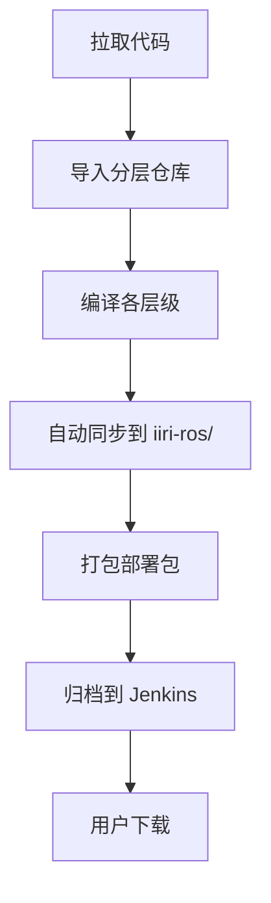

# IIRI ROS2 完整部署指南

> **文档位置**: `docs/deployment/deployment-guide.md`
> **最后更新**: 2025-10-13
> **作者**: 唐文浩

本文档提供从编译到生产环境部署的完整流程指南。

## 📋 部署概述

IIRI ROS2 采用**编译 → 打包 → 部署**的三步流程，支持从 Jenkins 直接下载带版本号的完整部署包。

### 核心特性

- ✅ 自动化打包：编译后自动生成部署包
- ✅ 版本追踪：Git tag + 时间戳
- ✅ 完整性校验：SHA256 校验和
- ✅ 多版本共存：支持快速回滚
- ✅ 简化部署：解压即用

## 🔄 三种部署流程

### 1️⃣ 本地开发部署

适用于开发人员本地测试：

```bash
# 1. 编译项目（自动同步到 iiri-ros/）
cd /path/to/iiri_ros2_architecture
./build_layered.sh application_layer

# 2. 进入 iiri-ros 目录测试
cd iiri-ros
source setup.bash
ros2 launch system_bringup full_system.launch.py

# ✅ 编译完成后会自动执行：
#    - build_x86_shared/install 生成编译产物
#    - 自动 rsync 到 iiri-ros/install/
#    - 立即可用于本地测试
```

**关键**：无需手动复制文件，编译脚本自动同步！

---

### 2️⃣ Jenkins CI/CD 自动部署

Jenkins 自动构建并生成部署包：



**Jenkins 流程**：
1. 定时或手动触发构建
2. vcstool 导入所有层代码
3. 分层编译（core → hardware → perception → intelligence → application）
4. 自动打包成 `iiri-ros-{arch}-{version}.tar.gz`
5. 生成 SHA256 校验文件
6. 归档到 Jenkins（保留最近 5 个版本）

**下载地址**：
```
http://192.168.1.59:8081/job/iiri-layered-build-ci/lastSuccessfulBuild/artifact/deploy_packages/
```

---

### 3️⃣ 生产环境部署

从 Jenkins 下载并部署到生产机器：

#### 快速部署（3 步完成）

```bash
# 步骤 1：下载部署包
cd /tmp
wget http://jenkins-server/job/iiri-layered-build-ci/lastSuccessfulBuild/artifact/deploy_packages/iiri-ros-arm-v1.2.3.tar.gz

# 步骤 2：验证完整性（推荐）
wget http://jenkins-server/job/iiri-layered-build-ci/lastSuccessfulBuild/artifact/deploy_packages/iiri-ros-arm-v1.2.3.tar.gz.sha256
sha256sum -c iiri-ros-arm-v1.2.3.tar.gz.sha256

# 步骤 3：一键部署
tar -xzf iiri-ros-arm-v1.2.3.tar.gz -C /home/wl/autorun/
cd /home/wl/autorun/iiri-ros-arm-v1.2.3
sudo ./install.sh
```

**`install.sh` 会自动执行**：
- 创建符号链接 `/home/wl/autorun/iiri-ros` → 当前版本
- 部署 systemd 服务文件
- 重载 systemd daemon
- 启用自启动服务
- 启动服务

#### 详细部署步骤

如果需要更细粒度的控制：

```bash
# 1. 下载并解压
tar -xzf iiri-ros-arm-v1.2.3.tar.gz -C /home/wl/autorun/

# 2. 手动创建符号链接
ln -snf /home/wl/autorun/iiri-ros-arm-v1.2.3 /home/wl/autorun/iiri-ros

# 3. 部署 systemd 服务
cd /home/wl/autorun/iiri-ros
sudo ./deploy_systemd_services.sh install

# 4. 启动服务
sudo systemctl start iiri-ros.service
sudo systemctl start iiri-qr.service

# 5. 验证状态
sudo systemctl status iiri-ros.service
sudo systemctl status iiri-qr.service
```

## 📦 部署包内容

每个部署包包含：

```
iiri-ros-arm-v1.2.3/
├── install/                        # ROS2 编译产物
│   ├── setup.bash                  # 环境设置脚本
│   └── lib/                        # 库文件和节点
├── deploy_systemd_services.sh      # Systemd 部署脚本
├── install.sh                      # 一键安装脚本
├── iiri-qr.service                 # QR 服务文件
├── iiri-ros.service                # ROS 服务文件
├── switch-version.sh               # 版本切换工具
├── VERSION.txt                     # 版本信息
└── README.md                       # 使用说明
```

### 版本信息示例

`VERSION.txt` 内容：

```
IIRI ROS2 Deployment Package
========================================
Architecture: arm
Version: v1.2.3-5-g1a2b3c4
Build Date: 2025-10-13 15:30:45 CST
Git Branch: master
Git Commit: 1a2b3c4d5e6f7g8h9i0j
Build Host: jenkins-build-01
========================================
```

## 🔄 版本管理和回滚

### 多版本共存

生产环境支持同时保留多个版本：

```bash
/home/wl/autorun/
├── iiri-ros -> iiri-ros-arm-v1.2.3    # 当前版本（符号链接）
├── iiri-ros-arm-v1.2.3/               # 最新版本
├── iiri-ros-arm-v1.2.2/               # 上一个版本
└── iiri-ros-arm-v1.2.1/               # 更早版本
```

### 版本切换

#### 方式 A：使用版本切换工具（推荐）

```bash
# 查看所有版本
sudo /home/wl/autorun/switch-version.sh list

# 切换到指定版本
sudo /home/wl/autorun/switch-version.sh iiri-ros-arm-v1.2.2

# 回滚到上一个版本
sudo /home/wl/autorun/switch-version.sh rollback
```

#### 方式 B：手动切换

```bash
# 1. 停止服务
sudo systemctl stop iiri-ros.service
sudo systemctl stop iiri-qr.service

# 2. 更新符号链接
sudo ln -snf /home/wl/autorun/iiri-ros-arm-v1.2.2 /home/wl/autorun/iiri-ros

# 3. 重启服务
sudo systemctl start iiri-ros.service
sudo systemctl start iiri-qr.service

# 4. 验证版本
cat /home/wl/autorun/iiri-ros/VERSION.txt
```

### 清理旧版本

保留最近 3 个版本，删除更早的：

```bash
cd /home/wl/autorun
ls -dt iiri-ros-arm-* | tail -n +4 | xargs rm -rf
```

## 🚀 性能数据

### 部署包大小

| 架构 | 未压缩 | 压缩后 | 压缩率 |
|------|--------|--------|--------|
| x86  | ~500MB | ~200MB | 60%    |
| ARM  | ~480MB | ~190MB | 60%    |

### 部署时间

| 操作 | 时间 |
|------|------|
| 下载部署包（100Mbps） | ~16秒 |
| 解压部署包 | ~5秒 |
| 部署服务 | ~3秒 |
| **总计** | **~24秒** |

### Jenkins 归档时间

- 旧方案（归档整个 install）: ~5分钟
- 新方案（归档 tar.gz）: ~30秒
- **提升**: 90% ⬇️

## 🛠️ 故障排除

### 问题 1：下载超时

**症状**：Jenkins 下载部署包超时

**解决方案**：
```bash
# 使用 wget 断点续传
wget -c http://jenkins-server/.../iiri-ros-arm-v1.2.3.tar.gz

# 或使用 curl
curl -C - -O http://jenkins-server/.../iiri-ros-arm-v1.2.3.tar.gz
```

### 问题 2：SHA256 校验失败

**症状**：`sha256sum -c` 报错

**解决方案**：
```bash
# 重新下载部署包
rm iiri-ros-arm-v1.2.3.tar.gz
wget http://jenkins-server/.../iiri-ros-arm-v1.2.3.tar.gz

# 重新验证
sha256sum -c iiri-ros-arm-v1.2.3.tar.gz.sha256
```

### 问题 3：服务启动失败

**症状**：`systemctl start iiri-ros.service` 失败

**排查步骤**：
```bash
# 1. 查看服务状态
sudo systemctl status iiri-ros.service

# 2. 查看详细日志
sudo journalctl -u iiri-ros.service -n 50

# 3. 检查符号链接
ls -la /home/wl/autorun/iiri-ros

# 4. 检查 install 目录权限
ls -la /home/wl/autorun/iiri-ros/install/

# 5. 手动测试启动
cd /home/wl/autorun/iiri-ros
source install/setup.bash
ros2 launch system_bringup full_system.launch.py
```

### 问题 4：版本回滚失败

**症状**：切换版本后服务异常

**解决方案**：
```bash
# 1. 完全停止服务
sudo systemctl stop iiri-ros.service
sudo systemctl stop iiri-qr.service

# 2. 清理可能的残留进程
pkill -f ros2
pkill -f qr_ctrl

# 3. 重新部署正确版本
sudo /home/wl/autorun/switch-version.sh iiri-ros-arm-v1.2.3

# 4. 重启服务
sudo systemctl daemon-reload
sudo systemctl start iiri-ros.service
sudo systemctl start iiri-qr.service
```

## 📚 相关文档

- **[Systemd 服务配置](systemd-services.md)** - 服务管理详解
- **[版本管理](version-management.md)** - 版本管理策略
- **[Jenkins 配置](../ci-cd/jenkins-setup.md)** - CI/CD 配置
- **[测试指南](../testing/testing-guide.md)** - 部署前测试

## 💡 最佳实践

### 部署前检查清单

- [ ] 验证部署包 SHA256 校验和
- [ ] 检查目标机器磁盘空间（至少 1GB）
- [ ] 备份当前运行版本
- [ ] 通知用户即将升级
- [ ] 准备回滚方案

### 部署后验证清单

- [ ] 服务状态正常 (`systemctl status`)
- [ ] 版本信息正确 (`VERSION.txt`)
- [ ] ROS2 节点正常运行 (`ros2 node list`)
- [ ] 日志无异常 (`journalctl -u iiri-ros.service`)
- [ ] 功能测试通过

### 生产环境建议

1. **保留历史版本**：至少保留最近 3 个稳定版本
2. **定期备份**：每周备份配置文件和数据
3. **监控告警**：配置服务异常告警
4. **滚动升级**：多机器环境采用滚动升级
5. **灰度发布**：新版本先在测试机验证

---

**文档更新**: 2025-10-13
**版本**: v2.0
**作者**: 唐文浩
