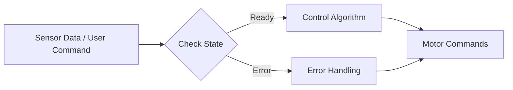

# 核心控制模块 (Core Control Modules)

## 1. 概述

核心控制模块是系统的"大脑"，负责协调传感器输入、状态估计、运动规划和指令输出。主要包括针对不同形态机器人的 `UserNode` 实现（四足/机械臂）、全局状态机 `RobotState` 以及手柄输入处理 `GamepadNode`。

## 2. 模块详解

### 2.1 UserQuadNode / UserArmNode

#### 2.1.1 核心功能
负责机器人的核心运动控制逻辑，根据机器人类型（四足或机械臂）加载相应的控制算法和状态机。

- **UserQuadNode**: 处理四足机器人的步态规划、平衡控制和地形适应。
- **UserArmNode**: 处理机械臂的逆运动学解算、轨迹规划和末端执行器控制。

#### 2.1.2 接口说明

| 接口名称 | 输入参数 | 输出参数 | 说明 |
| :--- | :--- | :--- | :--- |
| `Init` | 无 | `RetState` | 初始化节点，加载配置参数 |
| `Loop` | 无 | 无 | 主循环，执行周期性控制任务 |
| `SetCallback` | `type`, `func` | `RetState` | 注册外部事件的回调函数 |
| `GetRealLegWheelMotor` | 无 | `shared_ptr` | 获取真实电机控制实例 (仅Quad) |

#### 2.1.3 处理流程



#### 2.1.4 使用示例 (伪代码)

```cpp
// 初始化四足控制节点
auto quadNode = GetQuadNode();
if (quadNode.Init() != RetState::ok) {
    LOG_ERROR("Failed to init quad node");
    return;
}

// 在主循环中运行
while (running) {
    quadNode.Loop(); // 执行控制算法
}
```

### 2.2 RobotState (系统状态机)

#### 2.2.1 核心功能
维护系统的全局生命周期状态，确保系统在安全的模式下运行。

#### 2.2.2 状态定义
- `initing`: 初始化中，禁止电机输出。
- `standby`: 待机状态，电机上电但无动作。
- `running`: 正常运行，允许运动控制。
- `error`: 故障状态，触发紧急停止。
- `jointCtrl`: 关节控制模式（调试用）。

#### 2.2.3 接口说明

| 接口名称 | 输入参数 | 输出参数 | 说明 |
| :--- | :--- | :--- | :--- |
| `SetRobotCurState` | `RobotState` | 无 | 设置当前系统状态 |
| `GetRobotCurState` | 无 | `RobotState` | 获取当前系统状态 |

### 2.3 GamepadNode (手柄控制)

#### 2.3.1 核心功能
接收并解析蓝牙/USB手柄的输入信号，转换为标准化的控制指令（速度、模式切换等）。

#### 2.3.2 支持设备
- Xbox 360 / One Controller
- PS4 / PS5 Controller (通过映射)

#### 2.3.3 接口说明

| 接口名称 | 输入参数 | 输出参数 | 说明 |
| :--- | :--- | :--- | :--- |
| `Init` | 无 | `bool` | 初始化手柄驱动 |
| `GetData` | 无 | `GamepadData` | 获取当前按键和摇杆状态 |

## 3. 注意事项

1. **实时性要求**: `Loop` 函数必须在严格的时间片内完成（通常 < 2ms），避免阻塞操作。
2. **状态安全**: 任何状态切换到 `error` 必须是不可逆的，除非通过重启或显式复位。
3. **配置依赖**: 初始化前必须确保 `RobotConfig` 已正确加载。
