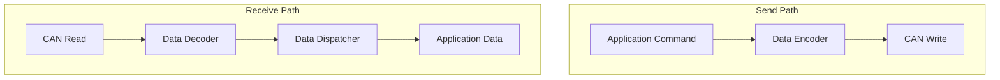

# 硬件抽象层 (Hardware Abstraction Layer)

## 1. 概述

硬件抽象层（HAL）负责屏蔽底层硬件的差异，为上层控制逻辑提供统一的接口。该层主要处理CAN总线通信、IMU数据采集、参数存储以及外设驱动。

## 2. 模块详解

### 2.1 CanBridge (CAN通信桥接)

#### 2.1.1 核心功能
负责与底层执行器（电机）、传感器和电源管理系统（BMS）进行CAN总线通信。支持数据的打包发送和接收解包。

#### 2.1.2 接口说明

| 接口名称 | 输入参数 | 输出参数 | 说明 |
| :--- | :--- | :--- | :--- |
| `Init` | 无 | `bool` | 初始化CAN硬件接口 |
| `Send` | `SensorCanData` | `void` | 发送CAN数据帧 |
| `RxBoardInfo` | `SensorCanData` | 无 | 处理板卡信息回调 |

#### 2.1.3 数据流向

### 2.2 ImuDrv (IMU驱动)

#### 2.2.1 核心功能
读取惯性测量单元（IMU）的数据，包括加速度、角速度和欧拉角/四元数，为姿态估计提供基础数据。

#### 2.2.2 接口说明

| 接口名称 | 输入参数 | 输出参数 | 说明 |
| :--- | :--- | :--- | :--- |
| `Init` | 无 | `bool` | 初始化IMU设备 |
| `GetImuData` | 无 | `ImuData` | 获取最新的IMU数据 |

### 2.3 DeviceCustomParam (设备参数管理)

#### 2.3.1 核心功能
负责设备特定参数（如电机零点、序列号、校准数据）的持久化存储和读取。

#### 2.3.2 接口说明

| 接口名称 | 输入参数 | 输出参数 | 说明 |
| :--- | :--- | :--- | :--- |
| `ReadMotorInitPos` | `key` | `vector<double>` | 读取电机初始位置 |
| `WriteMotorInitPos` | `key`, `value` | `bool` | 写入电机初始位置 |
| `WriteInitFlag` | `flag` | `bool` | 写入初始化标志位 |

## 3. 注意事项

1. **总线负载**: 在高频控制（1kHz+）下，需密切监控CAN总线负载率，避免丢包。
2. **数据同步**: IMU数据和电机反馈数据需要进行时间戳对齐，以保证控制算法的准确性。
3. **异常处理**: 当底层硬件通信超时或校验失败时，应立即向上层报告并进入保护状态。
