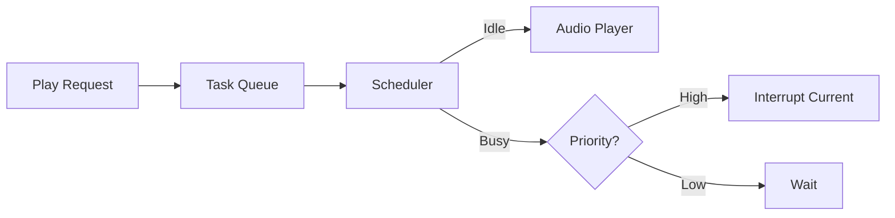
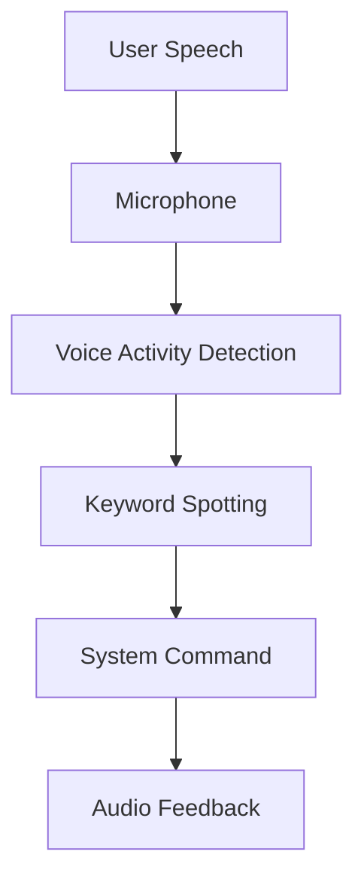

# 交互与服务模块 (Interaction & Services)

## 1. 概述

交互与服务模块负责系统的人机交互（HMI）和异步任务调度。主要包括事件中心 `MiniServer`、多媒体管理 `RobotMedia` 以及离线语音模块 `OfflineVoiceModule`。

## 2. 模块详解

### 2.1 MiniServer (事件中心)

#### 2.1.1 核心功能
`MiniServer` 是整个应用程序的事件循环核心，基于 `epoll` 或类似的机制实现高效的 I/O 多路复用。它负责调度定时任务、网络请求和系统事件。

#### 2.1.2 接口说明

| 接口名称 | 输入参数 | 输出参数 | 说明 |
| :--- | :--- | :--- | :--- |
| `Loop` | 无 | 无 | 启动事件循环，阻塞当前线程 |
| `AddTimeoutCallback` | `name`, `ms`, `func` | `bool` | 添加一次性或周期性定时任务 |
| `AddSocket` | `socket`, `callback` | `bool` | 注册 Socket 读写事件 |

#### 2.1.3 使用示例

```cpp
// 获取单例实例
auto& server = GetMiniServer();

// 添加一个1秒周期的心跳任务
server.AddTimeoutCallback("heartbeat", 1000, []() {
    LOG_INFO("System alive");
    return true; // 返回true表示继续执行
});

// 启动循环
server.Loop();
```

### 2.2 RobotMedia (多媒体管理)

#### 2.2.1 核心功能
管理系统的音频播放任务，支持任务队列、优先级抢占和状态反馈。主要用于播放提示音、报警声和语音反馈。

#### 2.2.2 接口说明

| 接口名称 | 输入参数 | 输出参数 | 说明 |
| :--- | :--- | :--- | :--- |
| `AddMediaPackage` | `package` | 无 | 将媒体任务添加到播放队列 |
| `Play` | `file` | `bool` | 立即播放指定文件（可能打断当前播放） |

#### 2.2.3 任务流程



### 2.3 OfflineVoiceModule (离线语音)

#### 2.3.1 核心功能
提供本地离线语音识别功能，将用户的语音指令转换为系统的控制命令。无需联网，保障了隐私和响应速度。

#### 2.3.2 支持指令
- 运动控制：前进、后退、左移、右移、停止
- 姿态调整：站高一点、趴低一点
- 系统控制：关机、休眠

#### 2.3.3 交互逻辑



## 3. 注意事项

1. **资源竞争**: `RobotMedia` 和 `OfflineVoice` 可能同时访问音频设备（声卡），需通过 ALSA 或 PulseAudio 进行合理的资源管理。
2. **实时性**: `MiniServer` 的回调函数应避免执行耗时操作，以免阻塞整个事件循环。
3. **环境干扰**: 语音模块在嘈杂环境下识别率可能下降，建议配合麦克风阵列降噪算法使用。
