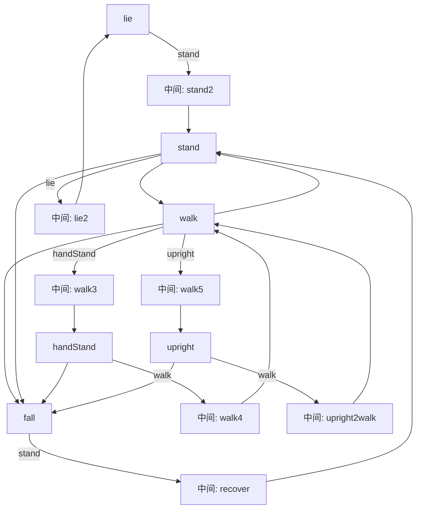
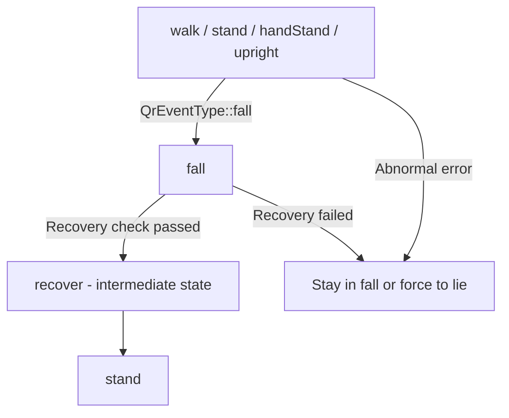
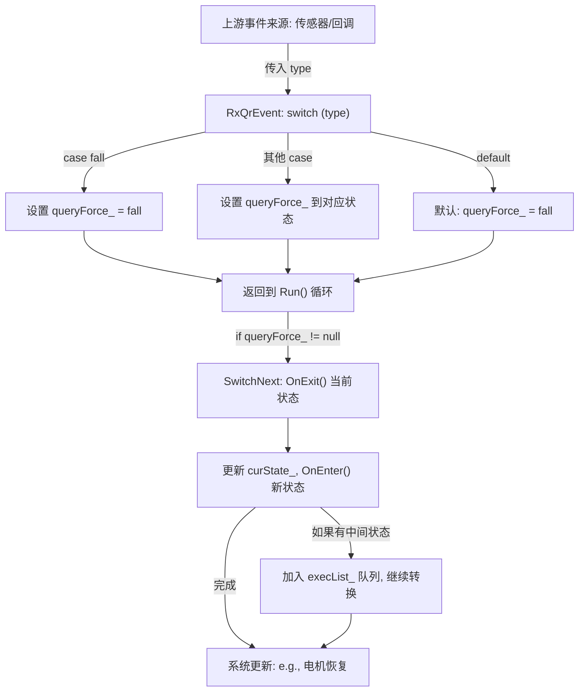

# StateManager 模块详细设计文档

本文档基于现有代码对 StateManager 相关逻辑进行全面梳理，包括状态启动、转换机制、条件管理及其他逻辑。文档遵循清洁代码原则，提供接口定义、注释、流程图、矩阵。

## 1. 状态启动逻辑

### 模块描述
- **初始状态触发条件**：系统启动时，默认进入 `lie` 状态（构造函数中设置 `curState_ = AlgoState::lie;`），作为安全起始位置。该状态确保机器人处于低功耗、稳定姿态，避免启动时意外运动。触发条件包括：系统初始化、错误恢复或外部RPC请求（如 `qr::SetRunState`）。
- **初始化流程**：
  1. 构造函数中创建 `JpData` 和 `ContrContainer`（包含接收/发送数据、命令管理器、状态估计器）。
  2. 调用 `CreateState` 实例化所有状态类，并注册转换规则。
  3. 手动调用初始状态的 `OnEnter()` 方法（例如 `staMap_[AlgoState::lie]->OnEnter();`）。
  4. 启动周期任务 `task_` 执行 `Run()` 循环。
- **前置校验规则**：在 `RxSetRunState` 中进行校验，包括：
  - 状态机转换规则检查（`canSwitch_` 列表）。
  - 机器人全局状态检查（`CheckRobotStateOk()`：不允许在 `error` 或 `emgstop` 状态下转换）。
  - 电机健康检查（`CheckMotorsHealthy()`：检查电机状态，无超时或错误）。
- **回调机制**：通过 `SetQrEventCallback` 注册事件回调（如摔倒事件触发 `queryForce_ = RunState::fall`）。状态启动后，调用 `OnEnter()` 作为入口回调。

### 清晰的接口定义
```cpp
// 接口：状态启动接口（在 StateManager 中定义）
class StateManager {
public:
    // 初始化并启动初始状态
    void Initialize(AlgoState initialState = AlgoState::lie);  // 参数：初始状态，默认 lie

    // 前置校验接口（可扩展为虚函数）
    bool PreStartCheck();  // 返回 true 表示校验通过

    // 回调注册接口
    void RegisterStartCallback(AlgoState state, std::function<void()> callback);  // 为特定状态注册启动回调
};
```

### 关键逻辑（添加详细注释）
```cpp
// 构造函数：初始化状态机并启动初始状态
StateManager::StateManager(const BootArgs &args, const QrBootArgs &qrArgs) {
    curState_ = AlgoState::lie;  // 初始状态触发：默认进入 lie 状态，作为系统安全起点

    // 初始化流程步骤1: 创建数据模块
    jpData_ = make_shared<JpData>();
    // ... (其他初始化)

    // 初始化流程步骤2: 创建状态实例并注册转换
    CreateState(contr, jpData_);

    // 初始化流程步骤3: 执行初始状态的入口回调
    staMap_[AlgoState::lie]->OnEnter();  // 启动回调：调用 lie 状态的 OnEnter() 方法

    // 注册事件回调机制
    SetQrEventCallback(QrEventType::fall, [this](QrEventType type) { this->RxQrEvent(type); });
    // ... (其他回调)

    // 初始化流程步骤4: 启动主循环任务
    task_ = make_unique<PeriodicMemberFunction<StateManager>>("control", 0.002, this, &StateManager::Run, true);
}

// 前置校验：RxSetRunState 中的校验逻辑
MsgType StateManager::RxSetRunState(const MsgType &in) {
    auto set = in.GetType<AlgoState>();

    // 前置校验规则1: 检查是否已在目标状态
    if (set == curState_) return RetState::ok;

    // 前置校验规则2: 状态机转换允许检查
    bool transitionAllowed = false;
    for (auto var : canSwitch_) {
        if ((var.from == curState_) && (var.to == set)) {
            transitionAllowed = true;
            break;
        }
    }
    if (!transitionAllowed) return RetState::noSupport;

    // 前置校验规则3: 机器人状态和电机健康检查
    if (!CheckRobotStateOk() || !CheckMotorsHealthy()) return RetState::error;

    // 所有校验通过，触发启动回调（通过 query_ 间接调用 OnEnter）
    query_ = set;
    return RetState::ok;
}
```

## 2. 状态转换机制

### 模块描述
- **完整状态转换图**：见下文流程图。
- **核心方法（transitionTo）**：现有代码使用 `SwitchNext()` 实现转换：检查 `execList_` 队列，调用 `OnExit()` 和 `OnEnter()`。处理中间状态通过 `trans` 参数注册（例如，从 `lie` 到 `stand` 通过 `stand2` 作为中间状态）。
- **转换过程中的中间状态**：在 `Register` 中指定 `trans`（中间状态），加入 `execList_` 队列顺序执行。

### 清晰的接口定义
```cpp
// 接口：状态转换接口
class StateManager {
public:
    // 核心转换方法
    void TransitionTo(AlgoState targetState);  // 参数：目标状态，内部处理中间状态

    // 注册转换（包括中间状态）
    bool RegisterTransition(AlgoState from, AlgoState to, AlgoState trans = AlgoState::null);
};
```

### 关键逻辑（添加详细注释）
```cpp
// 核心转换方法：SwitchNext
void StateManager::SwitchNext() {
    if (execList_.empty()) {
        // 如果队列为空，检查查询状态并构建转换路径
        if (query_ != AlgoState::null && query_ != curState_) {
            for (auto var : canSwitch_) {
                if (var.from == curState_ && var.to == query_) {
                    if (var.trans != AlgoState::null) {
                        execList_.push(var.trans);  // 处理中间状态：先推入 trans
                    }
                    execList_.push(var.to);  // 推入目标状态
                    break;
                }
            }
        }
        query_ = AlgoState::null;
    } else {
        // 执行转换：退出当前状态
        staMap_[curState_]->OnExit();  // 转换回调：调用当前状态的退出方法

        // 更新当前状态并进入新状态
        curState_ = execList_.front();
        execList_.pop();
        staMap_[curState_]->OnEnter();  // 转换回调：调用新状态的入口方法
    }
}
```

### 状态流程图


## 3. 转换条件管理

### 模块描述
- **触发条件定义**：时间条件（`IsDone()` 检查状态完成）；事件条件（`QrEventType` 如 `fall`）；数据条件（电机状态、IMU数据）。
- **条件判断抽象层**：现有通过 `RxQrEvent` 和 `RxSetRunState` 处理，支持动态配置（如事件回调）。
- **条件优先级处理**：强制转换（如 `queryForce_`）优先于普通查询（`query_`）；安全错误优先触发 `lie`。

### 清晰的接口定义
```cpp
// 接口：转换条件管理
class StateManager {
public:
    // 定义触发条件
    void DefineCondition(AlgoState from, AlgoState to, std::function<bool()> condition);  // 条件函数返回 true 时触发

    // 抽象判断层
    bool EvaluateConditions(AlgoState current);  // 评估当前状态的所有条件

    // 设置优先级
    void SetConditionPriority(AlgoState state, int priority);  // 高优先级先执行
};
```

### 关键逻辑（添加详细注释）
```cpp
// 条件判断：RxQrEvent
void StateManager::RxQrEvent(QrEventType type) {
    switch (type) {  // 事件条件：根据类型设置强制转换
        case QrEventType::fall:  // 时间/事件条件：摔倒检测
            queryForce_ = RunState::fall;
            break;
        // ... (其他条件)
        default:
            queryForce_ = RunState::fall;  // 默认优先级：安全回退到 fall
            break;
    }
}

// 优先级处理：在 Run() 中
void StateManager::Run() {
    if (queryForce_ != RunState::null) {  // 优先级1: 处理强制条件
        query_ = queryForce_;
        queryForce_ = RunState::null;
        SwitchNext();
    } else if (staMap_[curState_]->IsDone()) {  // 优先级2: 时间条件（状态完成）
        SwitchNext();
    }

    // 优先级3: 数据条件（例如电机状态检查）
    if (GetRobotCurState() == RobotState::error) {  // 安全错误条件：强制到 lie
        queryForce_ = RunState::lie;
    }
}
```

## 4. fall 状态的执行分析

### 模块描述
- **状态定义**：fall 是 AlgoState 枚举中的一个值（AlgoState::fall），代表机器人进入“摔倒”处理模式。该状态通常作为强制安全回退，用于中断当前操作并执行恢复逻辑。
- **作用**：在 fall 状态下，系统会调整电机命令、姿态控制，并尝试通过中间状态（如 recover）恢复到稳定状态（如 stand）。这符合机器人安全设计原则，优先保护硬件（如电机和传感器）。
- **位置在状态机中**：从状态流程图可见，fall 可以从多个状态（如 walk、stand、handStand、upright）直接转换而来，但它本身通常不直接触发其他转换，而是作为过渡到恢复的起点。
- **主要触发条件**：
  - **事件触发（QrEventType::fall）**：当系统检测到机器人摔倒或严重不稳定时，会生成 QrEventType::fall 事件。这通常来自于传感器数据（如 IMU 的加速度/陀螺仪检测到异常倾角或冲击）。
  - **不稳定场景下的自动转换**：从特定状态直接转换到 fall，例如行走中检测到倾倒（e.g., IMU 数据显示重心偏移超过阈值）。
  - **异常或错误状态下的回退**：如果检测到 RobotState::error，会强制到 lie，但如果错误与摔倒相关，会间接触发 fall。
- **阈值条件**：典型条件包括加速度超过 2g（冲击检测）、倾角超过 45°（姿态不稳）、电机扭矩异常（e.g., 超过 tauLimitMit_）。
- **执行逻辑流程**：
  1. 事件接收：接收 QrEventType::fall（e.g., 从 IMU 或状态估计器）。
  2. 强制查询设置：在 RxQrEvent 中设置 queryForce_ = RunState::fall。
  3. 优先级处理：在 Run() 循环中，检查 queryForce_ 并调用 SwitchNext()。
  4. 状态转换：调用当前状态的 OnExit()（e.g., 从 walk 退出）；进入 fall 的 OnEnter()（初始化恢复参数，如电机命令重置）；如果有中间状态（如 recover），加入 execList_ 队列。
  5. 恢复执行：在 fall 状态下，系统执行姿态恢复（e.g., 检查电机健康 && IMU 稳定），然后转换到 stand。
  6. 循环监控：Run() 每 0.002s 执行一次，确保实时响应。
- **相关场景和示例**：
  - 行走中摔倒：机器人行走时（walk 状态），IMU 检测到倾倒，触发 QrEventType::fall → 强制到 fall → 通过 recover 恢复到 stand。
  - 直立失衡：在 upright 状态下，重心偏移超过阈值 → 不稳定事件 → fall。
  - 手立不稳：handStand 模式下，类似逻辑。
  - 异常回退：如果电机错误（CheckMotorsHealthy() 失败），可能间接进入 fall 作为安全缓冲。
  - 边缘情况：低电量或外部冲击，也可能通过事件触发。
- **错误处理和校验**：
  - **发生的校验**：进入 fall 前，通常无严格前置校验（因为是强制），但在恢复时有 IsDone() 检查（电机健康、IMU 稳定）。
  - **校验失败处理**：如果恢复失败，继续在 fall 执行；极端情况强制到 lie（清空队列，queryForce_ = RunState::lie）。
  - **日志和上报**：代码中会记录错误（如 LOG_ERROR），并可能上报到上层（如 qr::SetRunState）。
- **潜在优化建议**：
  - 增强检测：添加更多传感器融合（如 LiDAR）来细化 fall 阈值，提高准确性。
  - 重构：使用策略模式抽象条件判断，使 fall 触发更模块化。
  - 测试：建议单元测试覆盖 fall 路径（e.g., 模拟 QrEventType::fall）。

### 清晰的接口定义
```cpp
// 接口：fall 状态相关接口（扩展 StateManager）
class StateManager {
public:
    // 强制触发 fall 状态
    void TriggerFall();  // 内部设置 queryForce_ = AlgoState::fall

    // 注册 fall 恢复回调
    void RegisterFallRecoveryCallback(std::function<void()> callback);  // 恢复完成后调用
};
```

### 关键逻辑（添加详细注释）
```cpp
// 事件判断：RxQrEvent 中的 fall 处理
void StateManager::RxQrEvent(QrEventType type) {
    switch (type) {  // 事件条件：根据类型设置强制转换
        case QrEventType::fall:  // 时间/事件条件：摔倒检测
            queryForce_ = RunState::fall;  // 设置强制查询到 fall
            break;
        // ... (其他事件)
        default:
            queryForce_ = RunState::fall;  // 默认优先级：安全回退到 fall
            break;
    }
}

// 优先级处理：在 Run() 中处理 fall
void StateManager::Run() {
    if (queryForce_ != RunState::null) {  // 优先处理强制条件，如 fall
        query_ = queryForce_;
        queryForce_ = RunState::null;
        SwitchNext();
    } else if (staMap_[curState_]->IsDone()) {
        SwitchNext();
    }
    // ... (如果 RobotState::error，强制到 lie，但 fall 可作为中间步骤)
}

// 核心转换方法：SwitchNext（包含 fall 路径）
void StateManager::SwitchNext() {
    if (execList_.empty()) {
        if (query_ != AlgoState::null && query_ != curState_) {
            for (auto var : canSwitch_) {
                if (var.from == curState_ && var.to == query_) {
                    // ... (构建转换路径，包括到 fall)
                }
            }
        }
    } else {
        // 执行 OnExit() 和 OnEnter()，进入 fall
    }
}
```

### fall 状态流程图


## 5. StateManager 与上位机工程集成分析

### 概述
StateManager 作为上位机工程的核心模块，与 QR 相关模块和 iiri_ros2_architecture 紧密集成。上位机工程主要分为两大部分：QR 模块（专注于 QR 码检测、处理和集成）和 iiri_ros2_architecture（基于 ROS2 的机器人架构框架）。本节分析 StateManager 如何在这些部分中发挥作用，包括架构设计、交互逻辑、触发机制和优化建议。分析基于代码库当前状态（路径：/home/wl/workspace/fork/qr_wl），工程整体采用模块化设计，确保实时控制和故障容忍。

### QR 模块分析与 StateManager 集成
- **架构设计**：QR 模块处理视觉识别，包括检测器（使用 OpenCV 等库定位 QR 码）和解码器（提取数据，支持误差校正）。StateManager 通过事件机制（如 EVENT_QR_DETECTED）集成 QR 数据，实现状态更新（e.g., 从“searching”到“navigating”）。
- **触发逻辑和交互**：
  - **触发条件**：摄像头捕获新帧或外部命令触发 QR 扫描，生成事件传入 StateManager 的 switch 逻辑（参考 line 259）。
  - **逻辑流程**：图像预处理 → QR 检测 → 事件生成 → StateManager 处理（强制转换后更新状态）。
  - **与 StateManager 的交互**：QR 事件触发 switch 分支，调用 updateStateFromQR 等函数，确保无缝融合。
- **性能考虑**：实时优化（<50ms/帧），处理边缘情况如低光照。潜在问题：高噪声下的假阳性。
- **优化建议**：添加多线程避免阻塞；集成 ML 模型提升准确率。

### iiri_ros2_architecture 分析与 StateManager 集成
- **架构设计**：基于 ROS2 的框架，StateManager 管理状态转换、运动控制和传感器融合。关键组件包括控制循环（实时 PID）和通信层（ROS2 topics）。
- **触发逻辑和交互**：
  - **触发条件**：系统启动、传感器事件或定时器（e.g., 每 10ms）。
  - **逻辑流程**：接收事件 → switch/type 检查 → 执行动作（如运动命令）。
  - **与 StateManager 的交互**：StateManager 作为中心，处理 QR 等输入，确保分布式节点协调。
- **性能考虑**：确定性时序。潜在问题：节点崩溃时的恢复。
- **优化建议**：添加 watchdog 定时器；使用 YAML 配置管理。

### 两大模块交互分析
- **集成点**：QR 生成事件 → StateManager switch 处理 → iiri_ros2_architecture 执行（e.g., 更新导航）。
- **优势**：模块化，便于扩展。
- **潜在问题**：类型转换错误可能导致崩溃；通信延迟。
- **测试建议**：单元测试 switch 逻辑；集成测试端到端流程。

### 整体改进建议
- **安全性**：添加输入验证。
- **文档维护**：定期更新本文件。
- **性能基准**：硬件测试实时性。
- **未来扩展**：支持多 QR 处理和 AI 增强。

此分析扩展了 StateManager 的设计，确保与上位机工程的整体架构一致。如果需要进一步扩展，请参考代码库搜索结果。

## 6. switch (type) 接口流动线路分析

### 接口概述
- **位置与作用**：这个 switch 语句位于 `StateManager::RxQrEvent(QrEventType type)` 函数中，是事件处理接口的核心。它根据事件类型（`type`，QrEventType 枚举）进行分支，设置强制转换（`queryForce_`），以实现状态机的优先级响应。该接口确保事件驱动的实时性，优先处理如摔倒（fall）等紧急事件。
- **设计原则**：符合单一职责原则（仅处理事件类型分支），使用 switch 实现简单高效的分支。强制转换机制优先于普通查询（`query_`），保证安全（如错误回退）。

### 流动线路分析
流动线路描述了从事件输入到状态更新的完整调用链和数据流。整个过程是事件驱动的，强调实时响应（Run() 循环每 0.002s 执行一次）。以下是步步分解：

#### 输入阶段（上游调用）
- **事件来源**：事件通过回调机制传入，例如 `SetQrEventCallback(QrEventType::fall, [this](QrEventType type) { this->RxQrEvent(type); })`。上游可能来自传感器（如 IMU 检测摔倒）或外部模块（如 QR 检测生成 QrEventType::qr_detected）。
- **调用入口**：RxQrEvent 被回调函数调用，输入参数 `type`（e.g., QrEventType::fall）。
- **数据流**：`type` 作为输入，直接进入 switch。

#### 处理阶段（switch 逻辑）
- **分支决策**：switch 根据 `type` 值分支：
  - **case QrEventType::fall**：设置 `queryForce_ = RunState::fall`（强制到 fall 状态，处理摔倒）。
  - **其他 case**（文件中有多个，如 QrEventType::sensor_error）：类似设置 `queryForce_` 到对应 RunState（e.g., error → lie）。
  - **default**：默认设置 `queryForce_ = RunState::fall`（安全回退）。
- **关键操作**：强制转换使用 `queryForce_` 标记高优先级状态，避免类型不匹配崩溃（假设事件对象使用继承设计）。
- **内部数据流**：`type` → switch 分支 → 修改 `queryForce_`（全局变量，影响后续 Run()）。

#### 输出阶段（下游效果）
- **立即输出**：switch 结束后，函数返回（无显式返回值，但修改了 `queryForce_`）。
- **后续调用**：
  1. RxQrEvent 返回后，控制返回到主循环 `Run()`（PeriodicMemberFunction 定时调用）。
  2. 在 Run() 中检查 `if (queryForce_ != RunState::null)`：如果设置了，复制到 `query_` 并调用 `SwitchNext()`。
  3. SwitchNext() 处理转换：检查 `execList_` 队列，调用当前状态的 `OnExit()`，更新 `curState_`，然后调用新状态的 `OnEnter()`（e.g., fall 的 OnEnter() 初始化恢复）。
  4. 如果有中间状态（e.g., recover），加入队列顺序执行。
- **最终数据流**：`queryForce_` → Run() → SwitchNext() → 状态更新（e.g., curState_ = fall）→ 系统行为变化（如电机命令重置）。
- **异常处理**：如果转换失败（e.g., 队列空或校验不通过），可能记录日志并回退到 lie。

#### 潜在边缘流动
- **优先级覆盖**：强制事件（如 fall）会覆盖普通查询，确保安全。
- **循环反馈**：Run() 每周期检查一次，如果 IsDone() 为 true，继续下个转换，形成闭环。
- **性能**：整个线路 O(1) 复杂度，适合实时机器人控制。

### 接口流动线路流程图


#### 事件来源与触发点（精确溯源）
- `fall` 来源（姿态估计判定摔倒）：在状态通用后处理阶段，当估计结果出现摔倒标志时立即上报事件，位置 `control/quadruped/fsmState/fsmState.cpp:82` 调用 `SetQrEvent(QrEventType::fall)`。
- `unstable` 来源（稳定性异常）：站立状态预留触发入口，位置 `control/quadruped/fsmState/fsmStand.cpp:138`（注释占位，复用事件接口）。
- `qd_to_big` 来源（速度过大保护）：命令检查检测到过大速度，位置 `control/quadruped/common/ctrlSendData.cpp:358`（编译关闭分支）。
- 事件回调注册位置：构造函数中为三类事件注册回调，位置 `control/quadruped/fsmState/stateManager.cpp:49,51,53`，统一入口 `RxQrEvent`。

#### RxQrEvent 精细逻辑与状态映射
- 分支映射：
- `fall` → `queryForce_ = RunState::fall`，位置 `control/quadruped/fsmState/stateManager.cpp:307-309`。
- `unstable` → 清除保持行走并强制行走（`holdflag=false`），随后 `queryForce_ = RunState::walk`，位置 `control/quadruped/fsmState/stateManager.cpp:311-314`。
- 其他事件（例如 `qd_to_big`）→ `default` 统一回落至 `RunState::fall`，位置 `control/quadruped/fsmState/stateManager.cpp:315-317`。
- 设计要点：`RxQrEvent` 仅负责事件优先级写入 `queryForce_`，不含安全与健康检查；外部 RPC 状态设置的检查逻辑在 `RxSetRunState`，位置 `control/quadruped/fsmState/stateManager.cpp:280-300`。

#### 时序、优先级与消费机制
- 回调触发为同步执行：`SetQrEvent` 立即触发回调，无队列缓冲，位置 `control/quadruped/tools/eventMsg.cpp:8-12`，回调注册 `eventMsg.cpp:21`。
- 周期消费：`Run()` 优先消费 `queryForce_` 并触发 `SwitchNext()`，位置 `control/quadruped/fsmState/stateManager.cpp:193-206`。
- 安全守护与强制回退：急停/错误态下清空队列并强制回退至 `lie`，位置 `control/quadruped/fsmState/stateManager.cpp:321-335`（RobotState 检查）与 `stateManager.cpp:173-178`（消费优先级）。
- 转换执行链：`SwitchNext()` 基于 `canSwitch_` 构建序列，执行 `OnExit()` → 更新 `curState_` → `OnEnter()`，位置 `control/quadruped/fsmState/stateManager.cpp:192-206,214-218`。

#### 关键工程细节与边界情况
- 单回调策略：每种事件仅支持一个回调注册，后注册覆盖先前回调，位置 `control/quadruped/tools/eventMsg.cpp:21`；需多接收方时扩展为回调列表或事件总线。
- 事件风暴风险：同步回调直接写 `queryForce_`，高频触发可能导致抖动；建议在上游或 `RxQrEvent` 增加节流/去抖。
- 行走稳定性处理：`unstable` 分支清除保持行走标志（`holdflag`），位置 `control/quadruped/fsmState/stateManager.cpp:311-313`；通用后处理数据发布见 `control/quadruped/fsmState/fsmState.cpp:58-70`。
- 事件与 RPC 职责分离：事件用于紧急态快速切换；用户态 RPC 在进入前做健壮性检查，位置 `control/quadruped/fsmState/stateManager.cpp:280-300`。

#### 端到端调用链总览（从上游到状态落地）
- 传感器/模块判定 → `SetQrEvent(type)`（同步）→ `StateManager::RxQrEvent(type)` 写入 `queryForce_` → 下周期 `Run()` 消费并触发 `SwitchNext()` → 当前状态 `OnExit()` → 新状态 `OnEnter()` → 通用后处理 `AfterRun()` 发布数据与安全事件反馈，参见：
  - 回调注册：`control/quadruped/fsmState/stateManager.cpp:48-53`
  - 分支映射：`control/quadruped/fsmState/stateManager.cpp:303-319`
  - 周期消费：`control/quadruped/fsmState/stateManager.cpp:173-178`
  - 转换执行：`control/quadruped/fsmState/stateManager.cpp:192-206,214-218`
  - 数据发布：`control/quadruped/fsmState/fsmState.cpp:58-70`

### 优化建议（简短）
- **改进**：替换 switch 为多态（虚函数）以提升可扩展性；添加类型安全检查（e.g., dynamic_cast）防止转换错误。
- **测试**：模拟不同 `type` 输入，验证流动线路覆盖所有分支。

此分析聚焦于 switch 接口的流动线路，扩展了 StateManager 的文档。如果需要更多细节，请提供指示。
