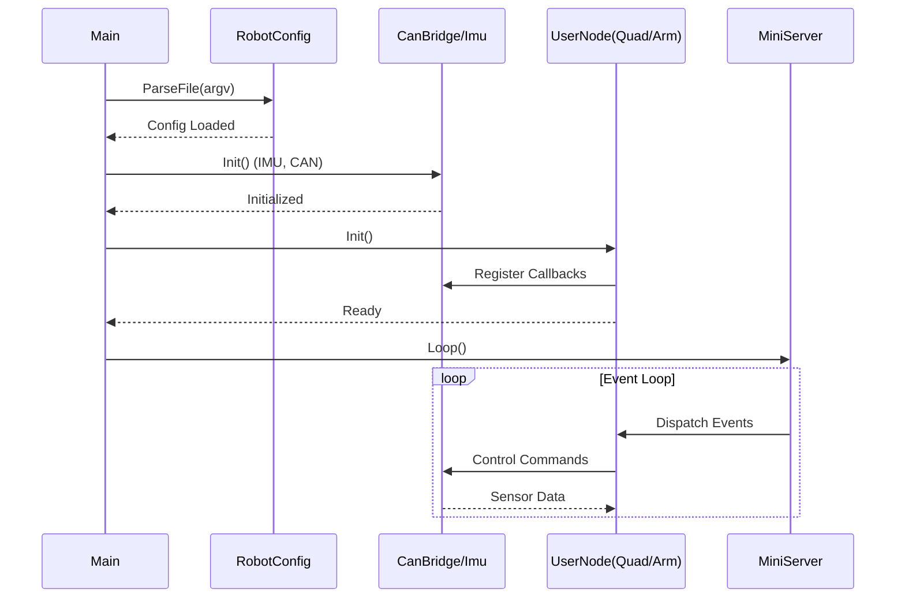
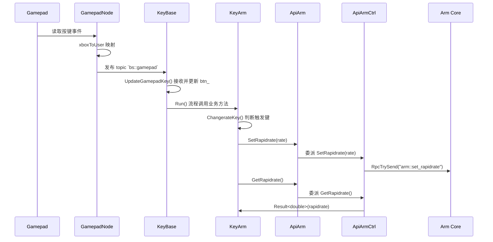

# 系统架构设计 (System Architecture)

## 1. 总体架构图

本系统采用分层架构设计，自下而上分为：硬件抽象层、核心逻辑层和应用接口层。各层之间通过标准接口进行交互，确保了系统的可扩展性和可维护性。

```mermaid
graph TD
    %% 样式定义
    classDef hardware fill:#f9f,stroke:#333,stroke-width:2px;
    classDef core fill:#bbf,stroke:#333,stroke-width:2px;
    classDef app fill:#bfb,stroke:#333,stroke-width:2px;

    subgraph "Application Interface Layer"
        MiniServer[MiniServer (Event Loop)]:::app
        RobotMedia[RobotMedia (Audio/Visual)]:::app
        OfflineVoice[OfflineVoiceModule (Voice Interaction)]:::app
        DebugTools[DebugTools (Logging/Debugging)]:::app
    end

    subgraph "Core Logic Layer"
        RobotState[RobotState (System State Machine)]:::core
        UserQuadNode[UserQuadNode (Quadruped Control Logic)]:::core
        UserArmNode[UserArmNode (Arm Control Logic)]:::core
        GamepadNode[GamepadNode (Remote Control)]:::core
        RobotConfig[RobotConfig (Configuration Manager)]:::core
    end

    subgraph "Hardware Abstraction Layer"
        CanBridge[CanBridge (CAN Bus Communication)]:::hardware
        ImuDrv[ImuDrv (IMU Sensor Driver)]:::hardware
        Realsense[Realsense (Depth Camera Driver)]:::hardware
        Gripper[Gripper (End Effector Driver)]:::hardware
        DeviceCustomParam[DeviceCustomParam (Parameter Storage)]:::hardware
    end

    %% 数据流向
    MiniServer --> UserQuadNode
    MiniServer --> UserArmNode
    GamepadNode --> UserQuadNode
    GamepadNode --> UserArmNode
    
    UserQuadNode --> CanBridge
    UserArmNode --> CanBridge
    UserArmNode --> Gripper
    
    CanBridge --> RobotState
    ImuDrv --> RobotState
    
    OfflineVoice --> MiniServer
    RobotMedia --> MiniServer
    
    RobotConfig --> DeviceCustomParam
    DeviceCustomParam --> CanBridge
    
    Realsense --> UserQuadNode

    %% 依赖关系
    RobotState -.-> MiniServer
    CanBridge -.-> DeviceCustomParam
```

## 2. 模块交互时序

系统启动及运行时的主要模块交互流程如下：



## 3. 核心设计理念

### 3.1 模块化与解耦
- **硬件无关性**: 通过硬件抽象层（HAL）隔离底层设备差异，上层业务逻辑只需关注标准数据结构（如 `MotorData`, `ImuData`）。
- **可插拔设计**: 不同的机器人形态（四足、机械臂）通过不同的 `UserNode` 实现，主程序根据配置文件动态加载。

### 3.2 事件驱动机制
- 系统基于 `MiniServer` 实现事件循环，所有模块通过注册回调函数或发布/订阅消息的方式进行交互，避免了复杂的线程同步问题。

### 3.3 状态机管理
- **状态机管理**: 引入全局 `RobotState` 管理系统生命周期（Init -> Standby -> Running -> Error），确保系统在任何时刻处于确定状态，并能有效处理异常转换。

## 4. 机械臂按键调用链（ChangerateKey）

- 入口函数：`KeyArm::ChangerateKey()` 在 `app/user/userArm/key/keyArm.cpp:365`，根据手柄按键触发快速速率调整（右键 0.7、左键 0.2）。
- 多态基础：`KeyArm` 继承 `KeyBase`，按键数据通过回调式接口统一处理，类定义于 `app/user/userArm/key/keyArm.hpp:7`，方法声明见 `app/user/userArm/key/keyArm.hpp:20`。
- 手柄事件源：`GamepadNode::Loop()` 读取硬件事件并发布 `bs::gamepad`，位置 `app/driver/gamepad.cpp:518`；消息被 `KeyBase::UpdateGamepadKey()` 接收并落入 `btn_` 映射，位置 `app/user/userDevice/key/keyBase.cpp:119`，底层保存接口 `app/user/userDevice/key/keyBase.cpp:78`。
- API 层调用：`ApiArm::SetRapidrate(double)` 与 `ApiArm::GetRapidrate()` 对外暴露，在 `app/user/userArm/api/apiArm.hpp:64-65`，实现转发见 `app/user/userArm/api/apiArm.cpp:205-206`。
- 控制核委派：`ApiArmCtrl::SetRapidrate(double)` 通过 RPC 调用控制核，位置 `control/arm/apiArmCtrl.cpp:391`；`ApiArmCtrl::GetRapidrate()` 从用户参数缓存读取当前速率，位置 `control/arm/apiArmCtrl.cpp:397`。
- RPC 明细：下行指令使用 `RpcTrySend("arm::set_rapidrate", rate, &ret)`，返回 `RetState`；上行查询通过 `GetUserParam()` 读取 `rapidrate` 字段并封装为 `Result<double>`。

### 调用链（顺序）



### 关键行为与返回

- 速率设置：`SetRapidrate(0.7|0.2)`，成功返回 `RetState::ok`；RPC 超时返回 `RetState::timeout`。
- 速率查询：`GetRapidrate()` 在控制核运行时返回 `Result<double>{RetState::ok, rapidrate}`；未运行返回 `RetState::noUpdate`。
- 多态耦合点：输入处理统一在 `KeyBase`，业务分发在派生类 `KeyArm`，保持输入层与业务层解耦。

### 调用点引用

- `app/user/userArm/key/keyArm.cpp:365-389`
- `app/user/userArm/key/keyArm.hpp:7,20`
- `app/user/userDevice/key/keyBase.cpp:78,119`
- `app/driver/gamepad.cpp:518`
- `app/user/userArm/api/apiArm.hpp:64-65`
- `app/user/userArm/api/apiArm.cpp:205-206`
- `control/arm/apiArmCtrl.cpp:391,397`
